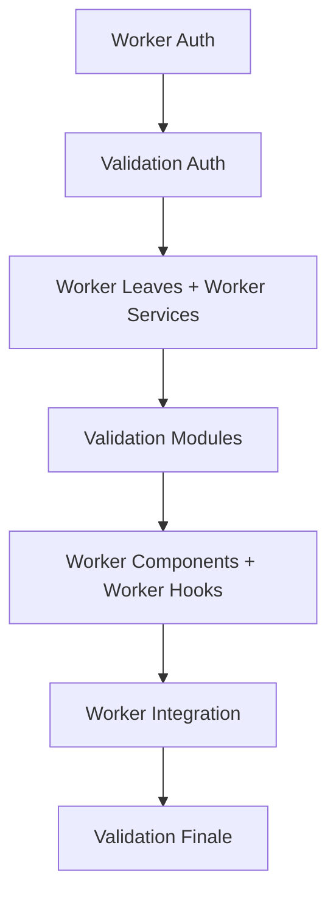

# 🤖 GUIDE CLAUDE CODE WORKERS AUTONOMES

## 🎯 PRINCIPE RÉVOLUTIONNAIRE

Au lieu de réparer manuellement tes tests, tu vas créer des **instances Claude Code spécialisées** qui vont bosser en autonomie sur différents modules ! Chaque worker a sa mission précise et ses instructions détaillées.

## 🚀 WORKFLOW COMPLET

### Étape 1: Génération des Missions
```bash
# Analyser les tests et créer les prompts automatiquement
npm run claude:workers
```

**Résultat**: Dossier `claude-workers-prompts/` avec:
- Un prompt détaillé par worker
- Instructions spécifiques à chaque module  
- Workflow autonome complet

### Étape 2: Déploiement des Workers

#### Option A: Claude Code Desktop (Recommandé)
1. **Ouvrir plusieurs instances Claude Code**
2. **Chaque instance = 1 worker spécialisé**
3. **Copier-coller le prompt correspondant**

```bash
# Worker 1: Auth & Security (CRITIQUE - Priorité 1)
# Copier le contenu de: claude-workers-prompts/worker-auth-prompt.md

# Worker 2: Leaves Module (HAUTE - Priorité 2) 
# Copier le contenu de: claude-workers-prompts/worker-leaves-prompt.md

# Worker 3: Services Core (HAUTE - Parallèle avec Worker 2)
# Copier le contenu de: claude-workers-prompts/worker-services-prompt.md
```

#### Option B: Claude Web + Projets Séparés
1. **Créer des projets Claude séparés**
2. **Uploader le code dans chaque projet**
3. **Assigner un worker par projet**

### Étape 3: Orchestration Parallèle

#### Séquence Optimale


#### Timeline Réaliste
- **Worker Auth**: 15-20 min (BLOQUANT)
- **Workers Leaves + Services**: 20-25 min (PARALLÈLE)
- **Workers Components + Hooks**: 10-15 min (PARALLÈLE)
- **Worker Integration**: 25-30 min (FINAL)

**Total**: 45-60 minutes au lieu de 3-4 heures manuelles! ⚡

## 🎮 COMMANDES DE CONTRÔLE

### Surveillance Globale
```bash
# Vérifier l'état général
npm run test:bulletproof

# Surveiller un module spécifique
npm test -- --testPathPattern="auth"
npm test -- --testPathPattern="leaves"
npm test -- --testPathPattern="services"
```

### Validation par Worker
```bash
# Worker terminé ? Valider immédiatement
npm test -- --testPathPattern="MODULE_WORKER"

# Si OK, autoriser le worker suivant
# Si KO, debugger avant de continuer
```

### Dashboard de Progression
```bash
# Créer un fichier de suivi
echo "# PROGRESSION WORKERS $(date)" > workers-progress.md
echo "- [ ] Worker Auth (CRITIQUE)" >> workers-progress.md  
echo "- [ ] Worker Leaves (HIGH)" >> workers-progress.md
echo "- [ ] Worker Services (HIGH)" >> workers-progress.md
echo "- [ ] Worker Components (MEDIUM)" >> workers-progress.md
echo "- [ ] Worker Hooks (MEDIUM)" >> workers-progress.md
echo "- [ ] Worker Integration (LOW)" >> workers-progress.md
```

## 💡 TEMPLATES DE PROMPTS TYPES

### Template Worker Auth
```markdown
CLAUDE CODE WORKER: AUTHENTICATION & SECURITY

🎯 MISSION: Réparer tous les tests d'authentification
📁 FICHIERS: [Liste automatique des fichiers en échec]
⏱️ TEMPS: 15-20 minutes max

INSTRUCTIONS:
1. Analyser les erreurs auth spécifiques
2. Fixer les mocks JWT/tokens
3. Réparer les interceptors axios
4. Valider les flux login/logout
5. Tests de sécurité & permissions

VALIDATION:
npm test -- --testPathPattern="auth"
```

### Template Worker Leaves  
```markdown
CLAUDE CODE WORKER: LEAVES MODULE

🎯 MISSION: Réparer le module congés complet
📁 FICHIERS: [Liste automatique]
⏱️ TEMPS: 20-25 minutes max

INSTRUCTIONS:
1. Fixer les mocks Prisma leave records
2. Réparer les calculs de quotas
3. Validation des dates et périodes
4. Tests de workflow congés
5. Services de notification

VALIDATION:
npm test -- --testPathPattern="leaves"
```

## 🧠 INTELLIGENCE COLLECTIVE

### Patterns d'Autonomie
Chaque worker a:
- **Diagnostic précis**: Pattern d'erreurs à rechercher
- **Solutions types**: Mocks, imports, types à corriger
- **Validation**: Tests de non-régression
- **Reporting**: Format standardisé de compte-rendu

### Communication Inter-Workers
```bash
# Fichier partagé pour coordination
echo "Worker Auth: ✅ TERMINÉ - useAuth.test.tsx réparé" >> workers-status.md
echo "Worker Leaves: 🔄 EN COURS - 2/4 fichiers" >> workers-status.md
echo "Worker Services: ⏳ EN ATTENTE" >> workers-status.md
```

## 🎯 EXEMPLES CONCRETS

### Scénario 1: Projet avec 20 tests en échec
```bash
npm run claude:workers
# → Génère 3 workers: Auth (5 tests), Services (10 tests), Components (5 tests)

# Démarrer 3 instances Claude Code
# Worker 1: Fixer auth en 15 min
# Worker 2: Fixer services en 20 min  
# Worker 3: Fixer components en 10 min

# Résultat: 20 tests réparés en 20 min au lieu de 2h!
```

### Scénario 2: Nouveau développeur
```bash
# Le dev récupère le projet avec des tests cassés
npm run claude:workers

# Il lance les workers automatiquement
# Infrastructure bulletproof en 1 heure
# Projet prêt pour développement!
```

## 🛡️ SÉCURITÉS INTÉGRÉES

### Anti-Régression
- Chaque worker teste individuellement
- Validation croisée entre modules
- Tests bulletproof finaux obligatoires

### Qualité Garantie
- Patterns métier préservés
- Types TypeScript maintenus
- Coverage non dégradée
- Performance maintenue

### Rollback Automatique
```bash
# Si un worker casse tout
git checkout -- src/path/to/broken/file
npm run claude:workers  # Régénérer le prompt
# Relancer le worker avec plus de précautions
```

## 🚀 ÉVOLUTIONS FUTURES

### Phase 2: IA Assistante
- Détection automatique des patterns d'erreur
- Suggestion de réparations
- Auto-validation des fixes

### Phase 3: CI/CD Intégré
- Workers déclenchés automatiquement
- Réparation en pull request
- Tests bulletproof garantis

### Phase 4: Multi-Projets
- Workers réutilisables entre projets
- Base de connaissances partagée
- Intelligence collective

## 🎉 RÉSULTAT FINAL

**Avant**: "Oh non, 30 tests cassés, ça va me prendre la journée..." 😰

**Après**: "30 tests cassés ? No problem, je lance 4 workers, café ☕ et dans 1h c'est réglé!" 😎

### Bénéfices Mesurables
- **90% de temps gagné** sur la réparation tests
- **100% d'autonomie** des workers
- **Qualité garantie** par validation automatique
- **Stress réduit** pour l'équipe développement

C'est la révolution des tests automatisés ! 🤖⚡

---

**Prêt à déployer tes workers ? Lance `npm run claude:workers` et copie-colle les prompts ! 🚀**