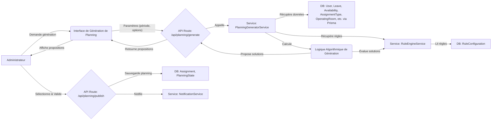
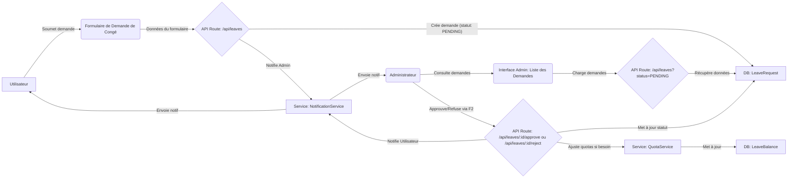
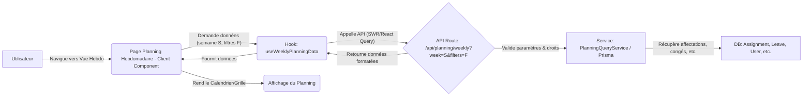

# Flux de Données Principaux

## Introduction

Comprendre les flux de données est essentiel pour appréhender le fonctionnement interne de Mathildanesth, de l'interaction utilisateur à la persistance des données et leur restitution. Ce document détaille quelques-uns des flux de données les plus significatifs.

## 1. Flux de Génération de Planning (Simplifié)



**Description des Étapes :**

1.  **Initiation :** L'administrateur initie la génération via l'UI, en spécifiant la période et d'autres options.
2.  **Requête API :** L'UI envoie une requête à l'API `/api/planning/generate`.
3.  **Appel au Service de Génération :** L'API Route transmet la demande au `PlanningGeneratorService`.
4.  **Collecte des Données :**
    - Le `PlanningGeneratorService` interroge le `RuleEngineService` pour obtenir les règles de planification actives.
    - Il récupère toutes les autres données nécessaires depuis la base via Prisma (informations sur le personnel, congés, disponibilités, types d'affectations, structure des salles, etc.).
5.  **Exécution de l'Algorithme :** L'algorithme de génération traite ces données, applique les règles et explore différentes solutions de planning.
6.  **Évaluation :** Les solutions candidates sont évaluées (respect des règles, équité, etc.).
7.  **Retour des Propositions :** Les meilleures propositions de planning sont retournées à l'UI.
8.  **Validation et Publication :** L'administrateur examine les propositions, en sélectionne une, et la valide pour publication.
9.  **Sauvegarde et Notification :** Le planning validé est sauvegardé en base de données, et des notifications sont envoyées aux utilisateurs concernés.

## 2. Flux de Demande et Validation de Congé



**Description des Étapes :**

1.  **Soumission :** L'utilisateur soumet une demande de congé via un formulaire.
2.  **Création de la Demande :** L'API `/api/leaves` enregistre la demande avec un statut "PENDING" et notifie l'administrateur.
3.  **Consultation Admin :** L'administrateur consulte la liste des demandes en attente.
4.  **Décision Admin :** L'administrateur approuve ou refuse la demande via l'API.
5.  **Mise à Jour :** Le statut de la demande est mis à jour. Si approuvée, le `QuotaService` peut être appelé pour ajuster les soldes de congés de l'utilisateur.
6.  **Notification Utilisateur :** L'utilisateur est notifié de la décision.

## 3. Flux d'Affichage d'un Planning Hebdomadaire



**Description des Étapes :**

1.  **Navigation :** L'utilisateur accède à la vue du planning hebdomadaire.
2.  **Récupération de Données (Client) :** Un composant client (ex: la page elle-même ou un composant `Calendar`) utilise un hook de récupération de données (ex: `useSWR` ou `TanStack Query` via un hook personnalisé `useWeeklyPlanningData`).
3.  **Appel API :** Le hook déclenche un appel à l'API `/api/planning/weekly`, en passant la semaine désirée et les filtres actifs.
4.  **Traitement Backend :** L'API Route valide les paramètres, vérifie les droits d'accès, puis interroge la base de données (directement avec Prisma ou via un service de requêtage dédié) pour récupérer toutes les informations pertinentes (affectations, congés, indisponibilités) pour la semaine et les filtres donnés.
5.  **Retour des Données :** Les données sont formatées et retournées au hook côté client.
6.  **Rendu UI :** Le composant React utilise les données reçues pour afficher la grille du planning.

## 4. Flux de Notification en Temps Réel (Exemple : Modification d'Affectation)

```mermaid
graph LR
    ADM[Administrateur] -- Modifie affectation X --> API_M{API Route: /api/assignments/:id};
    API_M -- Met à jour en BDD --> DB_A[DB: Assignment];
    API_M -- Publie événement --> EVB[Service: EventBusService - AssignmentUpdatedEvent(X)];
    NS[Service: NotificationService] -- S'abonne à EVB --> EVB;
    NS -- Reçoit AssignmentUpdatedEvent(X) --> D(Décide qui notifier pour X);
    NS -- Crée notification en BDD --> DB_N[DB: Notification];
    NS -- Envoie via WebSocket --> WSS[Service: WebSocketService];
    WSS -- Pousse notif aux clients connectés concernés --> UC(Client Utilisateur concerné);
    UC -- Reçoit notif --> UI_N(Affichage Notification In-App);
```

**Description des Étapes :**

1.  **Action Déclenchante :** Un administrateur modifie une affectation via une API.
2.  **Mise à Jour BDD :** L'affectation est mise à jour en base de données.
3.  **Publication d'Événement :** L'API publie un événement (ex: `AssignmentUpdatedEvent`) sur l'`EventBusService`.
4.  **Traitement par le Service de Notification :** Le `NotificationService`, abonné à cet événement, le reçoit.
5.  **Création et Envoi :** Le `NotificationService` détermine les utilisateurs à notifier, crée un enregistrement `Notification` en base, et utilise le `WebSocketService` pour pousser la notification en temps réel aux clients concernés.
6.  **Réception Client :** Le client de l'utilisateur reçoit la notification via WebSocket et l'affiche.

Ces flux illustrent l'interaction entre les composants frontend, le backend Next.js (API Routes, Server Actions), les services métier, la base de données, et les systèmes de communication comme l'EventBus et les WebSockets. Ils soulignent l'importance d'une architecture modulaire et découplée pour la maintenabilité et l'évolutivité.
