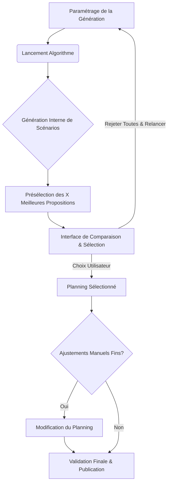

# Sélection et Comparaison des Propositions de Planning

## Introduction

Après l'exécution de l'algorithme de génération de planning, qui peut explorer de multiples scénarios en interne, Mathildanesth vise à offrir à l'utilisateur administrateur la possibilité de choisir parmi plusieurs propositions de planning jugées optimales selon différents critères. Cette fonctionnalité permet une prise de décision éclairée et une meilleure adéquation du planning final aux sensibilités et priorités du service.

## Objectifs

- **Offrir un choix** : Ne pas imposer un unique planning "parfait", mais présenter quelques alternatives viables.
- **Transparence** : Exposer clairement les caractéristiques, avantages et inconvénients de chaque proposition.
- **Aide à la décision** : Fournir des métriques comparatives pour faciliter le choix de l'administrateur.
- **Flexibilité** : Permettre d'équilibrer différemment les contraintes (ex: QVT vs. couverture stricte des besoins).

## Processus de Sélection des Propositions

1.  **Génération Interne de Scénarios** (par l'algorithme - voir `02_Algorithme_Generation.md`) :

    - L'algorithme, en fonction de son niveau d'optimisation et des paramètres, génère et évalue plusieurs solutions candidates.
    - Ces solutions peuvent résulter de différentes pondérations des critères (équité, QVT, satisfaction des préférences, robustesse opérationnelle).

2.  **Filtrage et Présélection** :

    - Seules les X meilleures propositions (ex: 2 à 4, configurable) sont retenues pour présentation à l'utilisateur.
    - Les propositions doivent être suffisamment distinctes pour offrir un réel choix.
    - Élimination des propositions contenant des violations de règles critiques non résolues (sauf si explicitement demandé par l'admin pour analyse).

3.  **Présentation à l'Utilisateur** :
    - Interface dédiée pour visualiser et comparer les propositions de planning.

## Interface Utilisateur de Comparaison et Sélection

L'interface devrait permettre à l'administrateur de :

1.  **Visualiser chaque proposition de planning** :

    - Affichage complet du planning (similaire à la vue de planning standard).
    - Possibilité de naviguer et de zoomer sur les détails.

2.  **Comparer les propositions sur la base de métriques clés** :

    - Tableau comparatif synthétique affichant pour chaque proposition :
      - `equityScore` (et ses composantes : Gini, stdDev des gardes...)
      - `satisfactionScore` (taux de respect des préférences)
      - `workloadBalance`
      - `fatigueScore` moyen ou distribution
      - Nombre de violations de règles (par sévérité : mineure, majeure)
      - Nombre de situations exceptionnelles ou de "points durs"
      - Indicateurs spécifiques (ex: nombre total de weekends de garde couverts, nombre de jours avec sous-effectif si applicable).
    - Graphiques comparatifs (ex: radar chart des métriques).

3.  **Afficher les "Points Forts" et "Points Faibles" de chaque proposition** :

    - Génération automatique d'un résumé textuel soulignant les aspects notables de chaque planning.
    - Exemple pour Planning A : "Respect maximal des règles de repos, mais 2 médecins dépassent légèrement le nombre de gardes de nuit souhaité."
    - Exemple pour Planning B : "Excellente satisfaction des préférences de congés, mais nécessite 1 situation de supervision exceptionnelle."

4.  **Détailler les violations de règles pour chaque proposition** :

    - Liste des règles non respectées (surtout mineures ou avertissements, si des plannings avec de telles violations sont proposés).
    - Impact de ces violations.

5.  **Sélectionner une proposition comme planning de base** :

    - Bouton pour "Choisir ce planning".
    - Le planning sélectionné devient alors le planning "actif" ou "brouillon avancé", potentiellement sujet à des ajustements manuels fins avant publication.

6.  **Option de rejet de toutes les propositions** :
    - Si aucune proposition n'est satisfaisante, possibilité de relancer la génération avec des paramètres ajustés (ex: autres pondérations, nouvelles contraintes).

## Intégration dans le Workflow de Planification

## Points de Configuration

- **Nombre de propositions à afficher** (ex: de 1 à 5).
- **Critères de "distinction" entre propositions** (pour éviter des plannings trop similaires).
- **Seuil de tolérance pour les violations de règles** dans les propositions (ex: autoriser les plannings avec seulement des avertissements).
- **Métriques prioritaires** à afficher en premier dans le comparatif.

## Conclusion

Offrir un choix éclairé à l'administrateur pour le planning final est une fonctionnalité à forte valeur ajoutée. Elle transforme le générateur de planning d'une "boîte noire" en un véritable outil d'aide à la décision, permettant de trouver le meilleur compromis possible entre les multiples contraintes et objectifs du service.

Cette approche nécessite un algorithme capable de générer plusieurs solutions viables et distinctes, ainsi qu'une interface utilisateur bien conçue pour la comparaison. La documentation des métriques d'équité et de QVT (`05_Equite_Qualite_Vie.md`) est fondamentale pour alimenter cette fonctionnalité.
