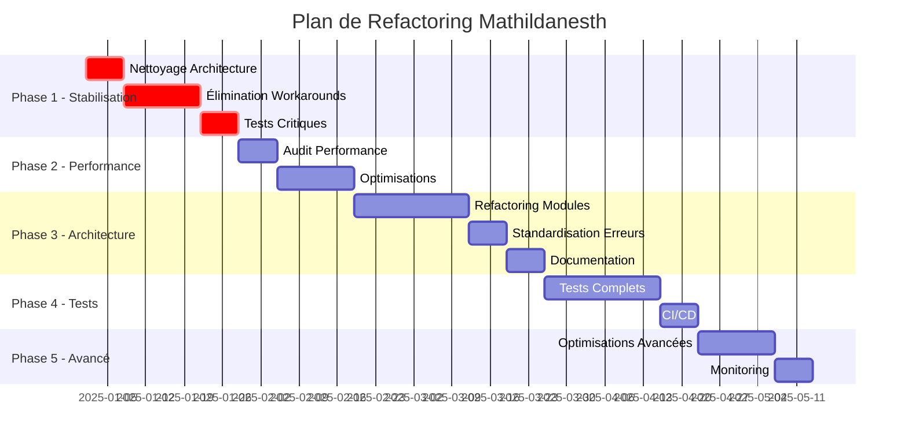

# Plan de Refactoring Technique - Mathildanesth

## Vue d'ensemble

Ce document présente un plan méthodique et détaillé pour corriger les failles techniques identifiées dans l'audit critique de l'application Mathildanesth. Le plan est structuré en phases progressives, avec des critères de succès mesurables et des estimations temporelles réalistes.

## État des Lieux - Problèmes Identifiés

### 🚨 Problèmes Critiques
1. **Dette technique importante** : 65 fichiers contenant TODO/FIXME/@ts-ignore
2. **Couverture de tests insuffisante** : 12% (131/1059 fichiers)
3. **Architecture incohérente** : Coexistence Pages Router + App Router
4. **Performance dégradée** : Page d'auth à 10.3s
5. **Complexité excessive** : 16 modules pour une application de planning

### 📊 Métriques de Départ
- **Fichiers TypeScript** : 1059
- **Fichiers de tests** : 131 (12.3%)
- **Workarounds techniques** : 65 fichiers
- **Modules** : 16
- **Performance critique** : 3 pages > 5s

## Phase 1 : Stabilisation (Priorité Critique) 
**Durée estimée : 3-4 semaines**

### 1.1 Nettoyage de l'Architecture de Routing
**Objectif** : Éliminer la coexistence dangereuse App Router / Pages Router

#### Actions :
1. **Audit complet des routes**
   ```bash
   # Script d'audit à créer
   find src/pages/api -name "*.ts" > pages-routes.txt
   find src/app/api -name "route.ts" > app-routes.txt
   # Identifier les doublons
   ```

2. **Migration vers App Router uniquement**
   - Supprimer tous les fichiers `src/pages/api/*`
   - Vérifier que toutes les fonctionnalités sont bien migrées dans `src/app/api/*`
   - Mettre à jour les imports et références

3. **Validation**
   - Tests d'intégration sur toutes les routes API
   - Vérification des types TypeScript
   - Tests E2E sur les parcours critiques

#### Critères de succès :
- ✅ 0 fichier dans `src/pages/api/`
- ✅ Toutes les routes API fonctionnelles en App Router
- ✅ 0 erreur TypeScript liée au routing

### 1.2 Élimination des Workarounds Techniques
**Objectif** : Supprimer tous les `@ts-ignore`, `TODO`, `FIXME`

#### Actions par type :

**1. @ts-ignore (Priorité 1)**
```typescript
// ❌ Avant
// @ts-ignore
const isServer = typeof window === 'undefined';

// ✅ Après
const isServer = typeof window === 'undefined';
```

**2. TODO/FIXME (Priorité 2)**
- Créer des tickets GitHub pour chaque TODO
- Implémenter les solutions ou supprimer le code mort
- Documenter les décisions de report

#### Script de tracking :
```bash
#!/bin/bash
# scripts/track-technical-debt.sh
echo "=== Audit Dette Technique ==="
echo "TODO/FIXME/HACK:"
grep -r "TODO\|FIXME\|HACK" src --include="*.ts" --include="*.tsx" | wc -l
echo "@ts-ignore:"
grep -r "@ts-ignore" src --include="*.ts" --include="*.tsx" | wc -l
echo "any types:"
grep -r ": any\|as any" src --include="*.ts" --include="*.tsx" | wc -l
```

#### Critères de succès :
- ✅ 0 `@ts-ignore` dans le code
- ✅ < 10 TODO/FIXME avec tickets associés
- ✅ < 5 types `any` en dehors des types tiers

### 1.3 Couverture de Tests - Phase 1
**Objectif** : Atteindre 40% de couverture sur les modules critiques

#### Priorités de test :
1. **Module Leaves** (critique métier)
   - Tests unitaires : `useLeaveCalculation`, `conflictDetectionService`
   - Tests d'intégration : Workflow complet de demande de congé
   
2. **Module Auth** (critique sécurité)
   - Tests unitaires : JWT validation, password hashing
   - Tests d'intégration : Login/logout workflows

3. **API Routes critiques**
   - Tests sur `/api/conges/*`
   - Tests sur `/api/auth/*`
   - Tests sur `/api/utilisateurs/*`

#### Template de test standard :
```typescript
// src/modules/conges/services/__tests__/leaveService.test.ts
import { describe, it, expect, beforeEach } from '@jest/globals';
import { LeaveService } from '../leaveService';

describe('LeaveService', () => {
  let service: LeaveService;

  beforeEach(() => {
    service = new LeaveService();
  });

  describe('calculateLeaveDays', () => {
    it('should calculate working days correctly', () => {
      // Test concret avec données réelles
    });

    it('should handle edge cases', () => {
      // Test des cas limites
    });
  });
});
```

#### Critères de succès :
- ✅ 40% de couverture globale (Jest coverage)
- ✅ 80% de couverture sur modules leaves et auth
- ✅ Tests d'intégration sur 5 workflows critiques

## Phase 2 : Performance et Optimisation (Priorité Haute)
**Durée estimée : 2-3 semaines**

### 2.1 Audit et Optimisation des Performances

#### Actions immédiates :
1. **Audit des requêtes Prisma**
   ```typescript
   // Script d'audit des N+1 queries
   // À ajouter dans src/scripts/audit-queries.ts
   ```

2. **Optimisation des pages critiques**
   - Page d'authentification (objectif : < 2s)
   - Page de planning (objectif : < 3s)
   - Dashboard admin (objectif : < 2s)

3. **Bundle analysis**
   ```bash
   npm run analyze
   # Identifier les packages lourds inutiles
   ```

#### Optimisations techniques :
1. **Code splitting intelligent**
   ```javascript
   // next.config.js
   module.exports = {
     experimental: {
       optimizeCss: true,
       optimizePackageImports: ['lucide-react', '@radix-ui/*']
     }
   }
   ```

2. **Cache strategy**
   - Redis pour les données fréquentes
   - SWR pour les requêtes client
   - Static generation pour les pages publiques

#### Critères de succès :
- ✅ Toutes les pages < 3s de chargement
- ✅ Bundle size < 1MB
- ✅ Lighthouse score > 90

### 2.2 Optimisation de l'Architecture des Données

#### Actions :
1. **Audit des modèles Prisma**
   - Optimiser les relations
   - Ajouter les index manquants
   - Simplifier les requêtes complexes

2. **Cache applicatif intelligent**
   ```typescript
   // src/lib/cache/intelligent-cache.ts
   export class IntelligentCache {
     // Stratégie de cache par type de données
   }
   ```

#### Critères de succès :
- ✅ Temps de réponse API < 100ms en moyenne
- ✅ Requêtes DB optimisées (< 50ms)

## Phase 3 : Simplification et Maintenabilité (Priorité Moyenne)
**Durée estimée : 4-5 semaines**

### 3.1 Refactoring de l'Architecture Modulaire

#### Analyse des modules actuels :
```
Modules à fusionner :
- analytics + dashboard → reporting
- profiles + settings → user-management  
- organization + unavailability → structure

Modules à conserver :
- leaves (critique métier)
- planning (critique métier)
- calendar (critique métier)
- rules (moteur de règles)
```

#### Plan de fusion :
1. **Phase 3.1.1** : Fusionner les modules analytics et dashboard
2. **Phase 3.1.2** : Simplifier les modules organization
3. **Phase 3.1.3** : Rationaliser la structure des services

#### Architecture cible :
```
src/
├── modules/
│   ├── core/           # Utils, types, hooks communs
│   ├── auth/           # Authentification
│   ├── leaves/         # Gestion congés (existant)
│   ├── planning/       # Génération planning (existant)
│   ├── bloc/           # Bloc opératoire (existant)
│   ├── calendar/       # Calendrier (existant)
│   ├── rules/          # Moteur de règles (existant)
│   ├── reporting/      # Analytics + Dashboard fusionnés
│   ├── users/          # Profiles + Settings fusionnés
│   └── structure/      # Organization + Sites
```

### 3.2 Standardisation de la Gestion d'Erreurs

#### Template standard :
```typescript
// src/lib/errors/AppError.ts
export class AppError extends Error {
  constructor(
    message: string,
    public code: string,
    public statusCode: number = 500,
    public isOperational: boolean = true
  ) {
    super(message);
    this.name = 'AppError';
    Error.captureStackTrace(this, this.constructor);
  }
}

// src/lib/errors/errorHandler.ts
export const handleApiError = (error: unknown): Response => {
  // Gestion standardisée
};
```

#### Critères de succès :
- ✅ Gestion d'erreurs unifiée dans toute l'app
- ✅ Logs structurés et cohérents
- ✅ Messages d'erreur utilisateur normalisés

### 3.3 Documentation du Code

#### Actions :
1. **JSDoc pour toutes les fonctions publiques**
   ```typescript
   /**
    * Calcule les jours de congés en excluant les weekends et jours fériés
    * @param startDate - Date de début (incluse)
    * @param endDate - Date de fin (incluse)
    * @param workSchedule - Planning de travail de l'utilisateur
    * @returns Nombre de jours ouvrés
    */
   export function calculateLeaveDays(
     startDate: Date,
     endDate: Date,
     workSchedule: WorkSchedule
   ): number {
     // Implementation
   }
   ```

2. **README pour chaque module**
3. **Exemples d'utilisation**

## Phase 4 : Tests et Qualité (Priorité Moyenne)
**Durée estimée : 3-4 semaines**

### 4.1 Atteindre 80% de Couverture de Tests

#### Stratégie par type :
1. **Tests unitaires** (objectif : 85% couverture)
   - Services métier
   - Hooks personnalisés
   - Utilitaires

2. **Tests d'intégration** (objectif : couverture workflow)
   - API endpoints complets
   - Modules inter-connectés

3. **Tests E2E** (objectif : parcours critiques)
   - Connexion utilisateur
   - Demande de congé complète
   - Génération de planning
   - Gestion bloc opératoire

#### Infrastructure de tests :
```typescript
// src/tests/setup.ts
// Configuration globale des tests

// src/tests/factories/
// Factories pour créer des données de test

// src/tests/helpers/
// Helpers et utilitaires de test
```

### 4.2 CI/CD et Qualité

#### Pipeline de qualité :
```yaml
# .github/workflows/quality-check.yml
name: Quality Check
on: [push, pull_request]
jobs:
  quality:
    runs-on: ubuntu-latest
    steps:
      - name: Lint
        run: npm run lint
      - name: Type Check
        run: npm run type-check
      - name: Unit Tests
        run: npm run test:coverage
      - name: E2E Tests
        run: npm run test:e2e
      - name: Performance Tests
        run: npm run test:performance
```

#### Critères de succès :
- ✅ 80% de couverture de tests
- ✅ 0 erreur ESLint
- ✅ 0 erreur TypeScript
- ✅ Pipeline CI/CD fonctionnel

## Phase 5 : Optimisations Avancées (Priorité Basse)
**Durée estimée : 2-3 semaines**

### 5.1 Performance Avancée
- Mise en place de SWR/React Query
- Optimisation des re-renders React
- Service Worker pour cache offline

### 5.2 Monitoring et Observabilité
- Intégration d'un APM (Application Performance Monitoring)
- Alertes automatiques sur les erreurs
- Dashboard de santé de l'application

## Planning Global et Jalons

### Timeline (16-19 semaines au total)



### Points de Contrôle (Milestones)

#### Milestone 1 - Fin Phase 1 (Semaine 4)
- [ ] 0 conflit d'architecture App/Pages Router
- [ ] < 5 @ts-ignore dans le code
- [ ] 40% de couverture de tests
- [ ] Tests E2E sur auth et leaves

#### Milestone 2 - Fin Phase 2 (Semaine 7) 
- [ ] Toutes les pages < 3s
- [ ] Bundle optimisé < 1MB
- [ ] API < 100ms en moyenne

#### Milestone 3 - Fin Phase 3 (Semaine 12)
- [ ] Architecture modulaire rationalisée
- [ ] Gestion d'erreurs unifiée
- [ ] Documentation complète

#### Milestone 4 - Fin Phase 4 (Semaine 16)
- [ ] 80% de couverture de tests
- [ ] Pipeline CI/CD opérationnel
- [ ] 0 erreur qualité

#### Milestone 5 - Fin Phase 5 (Semaine 19)
- [ ] Monitoring en place
- [ ] Performance optimale
- [ ] Application production-ready

## Métriques de Suivi

### Dashboard de Suivi Quotidien
```typescript
// metrics.ts - Métriques à suivre quotidiennement
export interface QualityMetrics {
  technicalDebt: {
    todoCount: number;
    tsIgnoreCount: number;
    anyTypeCount: number;
  };
  testCoverage: {
    overall: number;
    unit: number;
    integration: number;
    e2e: number;
  };
  performance: {
    avgPageLoad: number;
    apiResponseTime: number;
    bundleSize: number;
  };
  codeQuality: {
    eslintErrors: number;
    typeErrors: number;
    duplicatedCode: number;
  };
}
```

### Outils de Mesure
1. **Jest** : Couverture de tests
2. **ESLint** : Qualité de code
3. **TypeScript** : Erreurs de types
4. **Lighthouse** : Performance web
5. **Bundle Analyzer** : Taille des bundles
6. **SonarQube** : Qualité globale (optionnel)

## Stratégie de Déploiement

### Branches Git
```
main (production)
├── develop (intégration)
├── feature/phase-1-routing-cleanup
├── feature/phase-1-typescript-fixes
├── feature/phase-2-performance
└── feature/phase-3-architecture
```

### Déploiement Progressif
1. **Phase 1** : Branche `feature/stabilization` → `develop` → tests → `main`
2. **Phase 2** : Branche `feature/performance` → `develop` → benchmark → `main`
3. **Phases suivantes** : Même processus

### Tests de Non-Régression
Avant chaque déploiement en production :
- [ ] Suite complète de tests E2E
- [ ] Tests de performance
- [ ] Tests de charge sur staging
- [ ] Validation métier par utilisateurs tests

## Conclusion

Ce plan de refactoring est conçu pour être **méthodique, mesurable et progressif**. Chaque phase apporte une valeur immédiate tout en préparant les phases suivantes.

**Points clés du succès** :
1. **Priorisation stricte** : Stabilité avant optimisation
2. **Mesures objectives** : Métriques claires à chaque étape
3. **Tests continus** : Éviter les régressions
4. **Communication** : Points réguliers sur l'avancement

**Engagement de résultat** : À l'issue des 19 semaines, l'application sera techniquement robuste, performante et maintenable pour supporter une croissance à long terme.