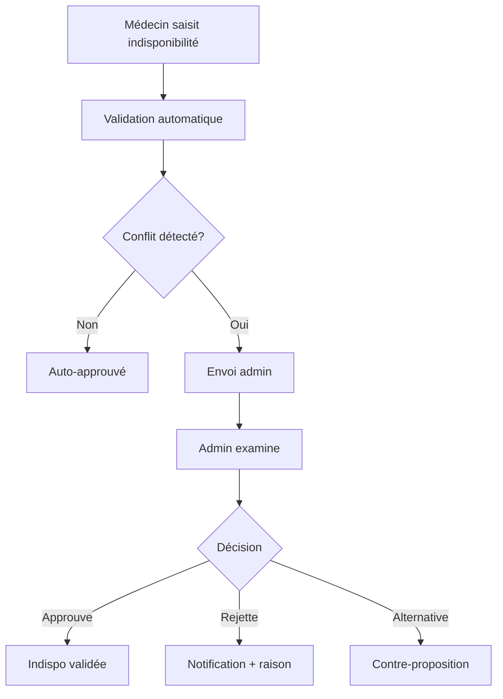

# 🚨 INDISPONIBILITÉS GARDES & ASTREINTES - Spécifications Techniques

*Fonctionnalité critique identifiée le 30/01/2025*

## 📋 VUE D'ENSEMBLE

**Problématique** : Les médecins doivent pouvoir indiquer leurs indisponibilités spécifiques pour les gardes et/ou astreintes, distinctement des congés classiques.

**Solution** : Interface granulaire permettant de spécifier :
- Indisponible pour GARDE uniquement
- Indisponible pour ASTREINTE uniquement  
- Indisponible pour GARDE ET ASTREINTE

---

## 🎯 SPÉCIFICATIONS FONCTIONNELLES

### 1. Types d'Indisponibilités

| Type | Description | Impact Planning |
|------|-------------|-----------------|
| `DUTY_ONLY` | Indisponible pour garde uniquement | Peut être d'astreinte |
| `ON_CALL_ONLY` | Indisponible pour astreinte uniquement | Peut être de garde |
| `BOTH` | Indisponible pour garde ET astreinte | Aucune affectation garde/astreinte |

### 2. Granularité Temporelle

- **Dates spécifiques** : 15 février, 22 mars, etc.
- **Périodes continues** : Du 1er au 7 février
- **Récurrences** :
  - Hebdomadaire : "Tous les vendredis"
  - Mensuelle : "Premier week-end de chaque mois"
  - Personnalisée : Pattern complexe

### 3. Workflow Validation



---

## 🏗️ ARCHITECTURE TECHNIQUE

### 1. Modèle de Données

**Nouveau type principal** : `DutyUnavailability`

```typescript
interface DutyUnavailability {
    id: string;
    doctorId: string;
    startDate: Date;
    endDate: Date;
    unavailableFor: 'DUTY_ONLY' | 'ON_CALL_ONLY' | 'BOTH';
    recurrenceType?: 'NONE' | 'WEEKLY' | 'MONTHLY' | 'CUSTOM';
    status: 'PENDING' | 'APPROVED' | 'REJECTED';
    // ... autres champs
}
```

### 2. Intégrations Système

**Extension existante** :
- `DutyPreference.unavailableDates` → migration vers `DutyUnavailability`
- `PlanningGeneratorService` → vérification automatique
- Module `unavailability` → spécialisation garde/astreinte

### 3. API Endpoints

```typescript
// CRUD de base
POST   /api/duty-unavailability          // Créer
GET    /api/duty-unavailability          // Lister avec filtres
GET    /api/duty-unavailability/:id      // Détail
PUT    /api/duty-unavailability/:id      // Modifier
DELETE /api/duty-unavailability/:id      // Supprimer

// Actions spécifiques
POST   /api/duty-unavailability/:id/approve    // Approuver
POST   /api/duty-unavailability/:id/reject     // Rejeter
GET    /api/duty-unavailability/conflicts      // Détecter conflits
GET    /api/doctors/:id/duty-unavailability    // Par médecin
```

---

## 🎨 INTERFACES UTILISATEUR

### 1. Interface Médecin

**Localisation** : Profil médecin → Onglet "Mes Indisponibilités"

**Composants** :
- `DutyUnavailabilityCalendar` : Calendrier avec sélection
- `DutyUnavailabilityForm` : Formulaire création/édition
- `DutyUnavailabilityList` : Liste avec statuts

**Fonctionnalités** :
- ✅ Sélection date(s) intuitive
- ✅ Choix type indisponibilité
- ✅ Gestion récurrence simple
- ✅ Visualisation statuts (pending/approved/rejected)
- ✅ Modification/suppression si non approuvé

### 2. Interface Admin

**Localisation** : Administration → Gestion Indisponibilités

**Composants** :
- `DutyUnavailabilityDashboard` : Vue d'ensemble
- `DutyUnavailabilityTable` : Tableau filtrable
- `DutyUnavailabilityConflictDetector` : Détection conflits

**Fonctionnalités** :
- ✅ Approbation/rejet en lot
- ✅ Détection conflits automatique
- ✅ Vue consolidée par médecin/période
- ✅ Export planning avec indisponibilités
- ✅ Notifications automatiques

---

## 🔄 INTÉGRATION PLANNING

### 1. Algorithme Génération

**Modification `PlanningGeneratorService.isUserAvailable()`** :

```typescript
private isUserAvailable(user: User, date: Date, shiftType: ShiftType): boolean {
    // Vérifications existantes...
    
    // NOUVEAU: Vérification indisponibilités spécifiques
    const dutyUnavailabilities = this.getDutyUnavailabilities(user.id, date);
    
    for (const unavailability of dutyUnavailabilities) {
        if (unavailability.status !== 'APPROVED') continue;
        
        if (shiftType.includes('GARDE') && 
            (unavailability.unavailableFor === 'DUTY_ONLY' || unavailability.unavailableFor === 'BOTH')) {
            return false;
        }
        
        if (shiftType.includes('ASTREINTE') && 
            (unavailability.unavailableFor === 'ON_CALL_ONLY' || unavailability.unavailableFor === 'BOTH')) {
            return false;
        }
    }
    
    return true;
}
```

### 2. Détection Conflits

**Service** : `DutyUnavailabilityConflictService`

```typescript
detectConflicts(unavailability: DutyUnavailability): DutyUnavailabilityConflict[] {
    // Conflits avec plannings existants
    // Conflits avec autres indisponibilités
    // Conflits avec congés approuvés
    // Etc.
}
```

---

## 📊 MIGRATION & DÉPLOIEMENT

### 1. Migration Données

**Étape 1** : Créer nouvelles tables
```sql
CREATE TABLE duty_unavailabilities (
    id UUID PRIMARY KEY,
    doctor_id UUID REFERENCES users(id),
    start_date TIMESTAMP NOT NULL,
    end_date TIMESTAMP NOT NULL,
    unavailable_for VARCHAR(20) NOT NULL,
    -- ... autres colonnes
);
```

**Étape 2** : Migrer données existantes
```typescript
// DutyPreference.unavailableDates → DutyUnavailability
// Type par défaut : 'BOTH'
```

### 2. Tests Critiques

**Tests unitaires** :
- [ ] Création/modification indisponibilités
- [ ] Détection conflits
- [ ] Intégration algorithme planning

**Tests E2E** :
- [ ] Workflow complet médecin
- [ ] Workflow approbation admin
- [ ] Génération planning avec indisponibilités

### 3. Formation Utilisateurs

**Médecins** :
- ✅ Guide interface calendrier
- ✅ Exemples cas d'usage
- ✅ Gestion récurrences

**Admins** :
- ✅ Processus validation
- ✅ Résolution conflits
- ✅ Intégration planning

---

## 🎯 PLAN DE DÉVELOPPEMENT

### Sprint 1 (1 semaine) - Fondations
- [ ] Modèle données TypeScript
- [ ] API endpoints CRUD
- [ ] Tests unitaires API
- [ ] Migration base existante

### Sprint 2 (1 semaine) - Interface Médecin
- [ ] Composant calendrier sélection
- [ ] Formulaire création/édition
- [ ] Liste indisponibilités
- [ ] Tests interface

### Sprint 3 (1 semaine) - Interface Admin
- [ ] Dashboard administration
- [ ] Workflow approbation
- [ ] Détection conflits
- [ ] Notifications

### Sprint 4 (1 semaine) - Intégration Planning
- [ ] Modification algorithme génération
- [ ] Tests intégration
- [ ] Documentation utilisateur
- [ ] Déploiement production

---

## 🚨 POINTS CRITIQUES

### Risques Identifiés
1. **Performance** : Récurrences complexes = calculs lourds
2. **UX** : Interface calendrier = complexité utilisateur
3. **Conflits** : Détection = faux positifs
4. **Migration** : Données existantes = perte informations

### Mitigation
1. **Cache** récurrences calculées
2. **Design** progressif (simple → avancé)
3. **Règles** métier précises
4. **Tests** migration exhaustifs

---

## ✅ CRITÈRES D'ACCEPTATION

### Médecin Standard
- [ ] Peut saisir indisponibilité garde/astreinte en <2 min
- [ ] Voit statut validation temps réel
- [ ] Modifie facilement récurrences simples
- [ ] Comprend impact sur planning

### Admin Planning
- [ ] Voit toutes demandes en attente
- [ ] Détecte conflits automatiquement
- [ ] Approuve/rejette en lot
- [ ] Planning généré respecte indisponibilités

### Système
- [ ] Aucune régression performance
- [ ] 100% indisponibilités prises en compte
- [ ] Notifications automatiques fiables
- [ ] Données migrées sans perte

---

*Cette fonctionnalité est CRITIQUE pour l'adoption terrain. Priorité absolue après stabilisation actuelle.* 