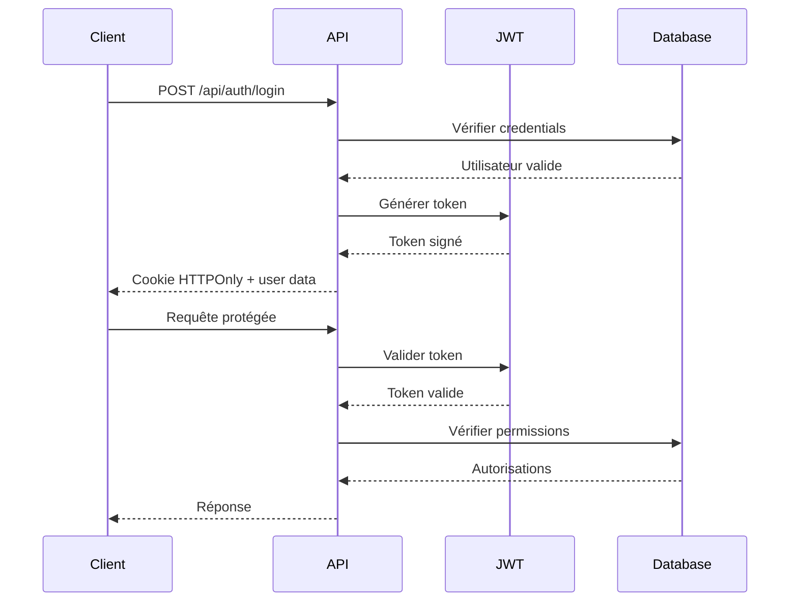

# Authentification API - Mathildanesth

## Vue d'ensemble

Le système d'authentification Mathildanesth utilise JWT (JSON Web Tokens) avec des cookies HTTPOnly pour une sécurité maximale, complété par un système RBAC (Role-Based Access Control) adapté au contexte médical.

## Architecture d'Authentification

### Flow d'Authentification


## Endpoints d'Authentification

### POST /api/auth/login
Connexion utilisateur avec credentials

**Request:**
```typescript
interface LoginRequest {
  email: string;
  password: string;
  rememberMe?: boolean;
}
```

**Headers:**
```http
Content-Type: application/json
```

**Body:**
```json
{
  "email": "jean.dupont@hopital.fr",
  "password": "motdepasse123",
  "rememberMe": true
}
```

**Response (200):**
```json
{
  "success": true,
  "data": {
    "user": {
      "id": "user_123",
      "email": "jean.dupont@hopital.fr",
      "nom": "Dupont",
      "prenom": "Jean",
      "role": "MAR",
      "sites": [
        {
          "id": "site_1",
          "name": "Hôpital Principal"
        }
      ],
      "permissions": [
        "planning:read",
        "leaves:create",
        "leaves:read"
      ]
    },
    "expiresAt": "2025-06-06T15:30:00Z"
  }
}
```

**Cookies Set:**
```http
Set-Cookie: auth-token=eyJhbGciOiJIUzI1NiIs...; HttpOnly; Secure; SameSite=Strict; Max-Age=3600
Set-Cookie: refresh-token=eyJhbGciOiJIUzI1NiIs...; HttpOnly; Secure; SameSite=Strict; Max-Age=604800
```

**Erreurs Possibles:**
```json
// 401 - Credentials invalides
{
  "success": false,
  "error": {
    "message": "Email ou mot de passe incorrect",
    "code": "INVALID_CREDENTIALS"
  }
}

// 423 - Compte verrouillé
{
  "success": false,
  "error": {
    "message": "Compte temporairement verrouillé après 5 tentatives",
    "code": "ACCOUNT_LOCKED",
    "details": {
      "unlockAt": "2025-06-06T16:00:00Z",
      "remainingAttempts": 0
    }
  }
}
```

### POST /api/auth/logout
Déconnexion et invalidation des tokens

**Headers:**
```http
Cookie: auth-token=eyJhbGciOiJIUzI1NiIs...
```

**Response (200):**
```json
{
  "success": true,
  "message": "Déconnexion réussie"
}
```

**Cookies Cleared:**
```http
Set-Cookie: auth-token=; HttpOnly; Secure; SameSite=Strict; Max-Age=0
Set-Cookie: refresh-token=; HttpOnly; Secure; SameSite=Strict; Max-Age=0
```

### GET /api/auth/me
Récupération des informations utilisateur connecté

**Headers:**
```http
Cookie: auth-token=eyJhbGciOiJIUzI1NiIs...
```

**Response (200):**
```json
{
  "success": true,
  "data": {
    "user": {
      "id": "user_123",
      "email": "jean.dupont@hopital.fr",
      "nom": "Dupont",
      "prenom": "Jean",
      "role": "MAR",
      "sites": [...],
      "permissions": [...],
      "lastLoginAt": "2025-06-06T14:30:00Z",
      "preferences": {
        "theme": "light",
        "language": "fr",
        "notifications": true
      }
    }
  }
}
```

### POST /api/auth/refresh
Renouvellement du token d'accès

**Headers:**
```http
Cookie: refresh-token=eyJhbGciOiJIUzI1NiIs...
```

**Response (200):**
```json
{
  "success": true,
  "data": {
    "expiresAt": "2025-06-06T16:30:00Z"
  }
}
```

**New Cookie:**
```http
Set-Cookie: auth-token=eyJhbGciOiJIUzI1NiIs...; HttpOnly; Secure; SameSite=Strict; Max-Age=3600
```

### POST /api/auth/forgot-password
Demande de réinitialisation de mot de passe

**Request:**
```json
{
  "email": "jean.dupont@hopital.fr"
}
```

**Response (200):**
```json
{
  "success": true,
  "message": "Email de réinitialisation envoyé"
}
```

### POST /api/auth/reset-password
Réinitialisation du mot de passe

**Request:**
```json
{
  "token": "reset_token_123",
  "newPassword": "nouveaumotdepasse123",
  "confirmPassword": "nouveaumotdepasse123"
}
```

**Response (200):**
```json
{
  "success": true,
  "message": "Mot de passe réinitialisé avec succès"
}
```

## Système de Rôles et Permissions

### Rôles Disponibles

#### ADMIN_TOTAL
- Accès complet à toutes les fonctionnalités
- Gestion des utilisateurs et sites
- Configuration du système
- Accès aux rapports et statistiques

#### ADMIN_PARTIEL
- Gestion du planning et des congés
- Validation des demandes
- Rapports limités
- Pas de gestion utilisateurs

#### MAR (Médecin Anesthésiste Réanimateur)
- Consultation et modification de son planning
- Demandes de congés
- Accès aux informations équipe
- Échanges de gardes

#### IADE (Infirmier Anesthésiste Diplômé d'État)
- Consultation de son planning
- Demandes de congés
- Accès limité aux informations équipe

#### CHIRURGIEN
- Consultation des plannings d'anesthésie
- Interface spécialisée interventions
- Accès lecture seule

#### USER
- Accès minimal au système
- Consultation planning personnel uniquement

### Permissions Granulaires

```typescript
interface Permission {
  resource: string;    // planning, leaves, users, admin
  action: string;      // create, read, update, delete
  scope?: string;      // own, team, site, global
  conditions?: any;    // Conditions spécifiques
}
```

**Exemples de permissions :**
```typescript
const permissions = [
  // Planning
  'planning:read:own',           // Lire son planning
  'planning:read:team',          // Lire planning équipe
  'planning:update:own',         // Modifier son planning
  'planning:update:team',        // Modifier planning équipe
  'planning:create:site',        // Créer planning site
  
  // Congés
  'leaves:create:own',           // Demander ses congés
  'leaves:read:own',             // Consulter ses congés
  'leaves:read:team',            // Consulter congés équipe
  'leaves:approve:team',         // Approuver congés équipe
  'leaves:approve:site',         // Approuver congés site
  
  // Administration
  'users:read:site',             // Lire utilisateurs site
  'users:create:site',           // Créer utilisateurs site
  'admin:access:dashboard',      // Accès dashboard admin
  'admin:access:reports',        // Accès rapports
  
  // Bloc opératoire
  'bloc:read:site',              // Consulter bloc site
  'bloc:update:site',            // Modifier bloc site
  'salles:manage:site'           // Gérer salles site
];
```

### Matrice Rôles-Permissions

| Permission | ADMIN_TOTAL | ADMIN_PARTIEL | MAR | IADE | CHIRURGIEN | USER |
|------------|-------------|---------------|-----|------|------------|------|
| planning:read:own | ✅ | ✅ | ✅ | ✅ | ✅ | ✅ |
| planning:read:team | ✅ | ✅ | ✅ | ✅ | ❌ | ❌ |
| planning:update:own | ✅ | ✅ | ✅ | ✅ | ❌ | ❌ |
| planning:update:team | ✅ | ✅ | ✅ | ❌ | ❌ | ❌ |
| leaves:approve:team | ✅ | ✅ | ✅ | ❌ | ❌ | ❌ |
| users:create:site | ✅ | ❌ | ❌ | ❌ | ❌ | ❌ |
| admin:access:dashboard | ✅ | ✅ | ❌ | ❌ | ❌ | ❌ |

## Middleware d'Autorisation

### Vérification Token
```typescript
// middleware/auth.ts
export async function authMiddleware(request: NextRequest) {
  const token = request.cookies.get('auth-token')?.value;
  
  if (!token) {
    return unauthorized('Token manquant');
  }
  
  try {
    const payload = await jwt.verify(token, JWT_SECRET);
    const user = await getUserById(payload.userId);
    
    if (!user || !user.isActive) {
      return unauthorized('Utilisateur inactif');
    }
    
    // Ajouter user au contexte request
    request.user = user;
    return NextResponse.next();
    
  } catch (error) {
    return unauthorized('Token invalide');
  }
}
```

### Vérification Permissions
```typescript
// utils/permissions.ts
export function hasPermission(
  user: User, 
  resource: string, 
  action: string, 
  scope?: string
): boolean {
  const permission = `${resource}:${action}${scope ? ':' + scope : ''}`;
  
  // Vérifier permissions directes
  if (user.permissions.includes(permission)) {
    return true;
  }
  
  // Vérifier permissions par rôle
  const rolePermissions = getRolePermissions(user.role);
  return rolePermissions.includes(permission);
}

// Exemple d'utilisation
function requirePermission(permission: string) {
  return (req: NextRequest, res: NextResponse) => {
    if (!hasPermission(req.user, ...permission.split(':'))) {
      return forbidden('Permission insuffisante');
    }
    return NextResponse.next();
  };
}
```

## Sécurité

### Configuration JWT
```typescript
const JWT_CONFIG = {
  accessTokenExpiry: '1h',      // Token d'accès : 1 heure
  refreshTokenExpiry: '7d',     // Token refresh : 7 jours
  algorithm: 'HS256',           // Algorithme de signature
  issuer: 'mathildanesth',      // Émetteur
  audience: 'mathildanesth-api' // Audience
};
```

### Protection contre les Attaques

#### Rate Limiting
```typescript
const AUTH_RATE_LIMITS = {
  login: {
    windowMs: 15 * 60 * 1000,    // 15 minutes
    max: 5,                      // 5 tentatives max
    blockDuration: 15 * 60 * 1000 // Blocage 15 min
  },
  refresh: {
    windowMs: 15 * 60 * 1000,    // 15 minutes
    max: 10                      // 10 refresh max
  }
};
```

#### Validation Stricte
```typescript
const loginSchema = z.object({
  email: z.string()
    .email('Email invalide')
    .max(255, 'Email trop long'),
  password: z.string()
    .min(8, 'Mot de passe trop court')
    .max(128, 'Mot de passe trop long'),
  rememberMe: z.boolean().optional().default(false)
});
```

#### Audit Logs
```typescript
// Log de toutes les actions d'authentification
await auditLog.create({
  action: 'LOGIN_SUCCESS',
  userId: user.id,
  ipAddress: getClientIP(request),
  userAgent: request.headers.get('user-agent'),
  details: {
    email: user.email,
    role: user.role
  }
});
```

### Headers de Sécurité
```http
X-Content-Type-Options: nosniff
X-Frame-Options: DENY
X-XSS-Protection: 1; mode=block
Strict-Transport-Security: max-age=31536000; includeSubDomains
Content-Security-Policy: default-src 'self'
```

## Gestion des Sessions

### Cache Redis
```typescript
interface UserSession {
  userId: string;
  role: string;
  permissions: string[];
  sites: string[];
  loginAt: number;
  lastActivity: number;
  ipAddress: string;
}

// Cache des sessions actives
const SESSION_CACHE_TTL = 3600; // 1 heure
```

### Invalidation de Session
```typescript
// Invalidation manuelle (déconnexion admin)
POST /api/admin/users/{userId}/invalidate-session

// Invalidation automatique (changement de rôle)
// Toutes les sessions utilisateur invalidées lors de :
// - Changement de rôle
// - Désactivation du compte
// - Changement de mot de passe
```

## Tests d'Authentification

### Tests Unitaires
```typescript
describe('Authentication API', () => {
  test('should login with valid credentials', async () => {
    const response = await request(app)
      .post('/api/auth/login')
      .send({
        email: 'test@example.com',
        password: 'validpassword'
      });
      
    expect(response.status).toBe(200);
    expect(response.body.success).toBe(true);
    expect(response.body.data.user).toBeDefined();
  });
  
  test('should reject invalid credentials', async () => {
    const response = await request(app)
      .post('/api/auth/login')
      .send({
        email: 'test@example.com',
        password: 'wrongpassword'
      });
      
    expect(response.status).toBe(401);
    expect(response.body.error.code).toBe('INVALID_CREDENTIALS');
  });
});
```

---

*Documentation Authentification mise à jour : Juin 2025*