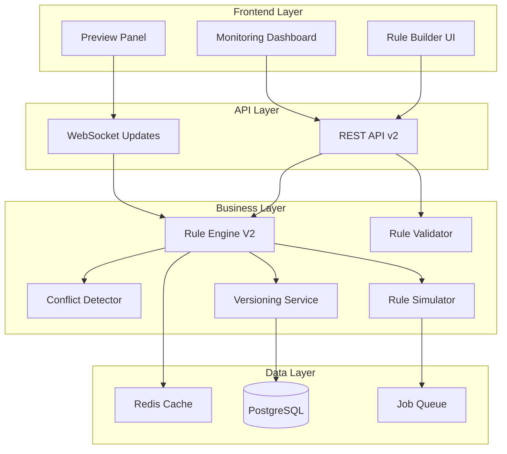

# Architecture Technique - Module de Règles Dynamiques V2

## Vue d'ensemble

Le module de règles dynamiques V2 est une refonte complète du système de règles métier, offrant une architecture modulaire, performante et extensible pour la gestion des règles de planning.

## Architecture générale



## Composants principaux

### 1. Rule Engine V2

**Localisation** : `/src/modules/dynamicRules/v2/services/RuleEngineV2.ts`

**Responsabilités** :
- Évaluation des règles selon le contexte
- Gestion du cache pour les performances
- Orchestration des différents services
- Émission d'événements pour le monitoring

**Caractéristiques clés** :
- Évaluation parallèle des règles indépendantes
- Cache LRU avec TTL configurable
- Support des règles composites
- Métriques de performance intégrées

### 2. Conflict Detector

**Localisation** : `/src/modules/dynamicRules/v2/services/ConflictDetector.ts`

**Types de conflits détectés** :
1. **Condition Overlap** : Détection des conditions qui se chevauchent
2. **Action Contradiction** : Actions mutuellement exclusives
3. **Resource Conflict** : Affectations multiples d'une même ressource
4. **Timing Conflict** : Incompatibilités temporelles

**Algorithmes utilisés** :
- Interval Tree pour les conflits temporels
- Graph coloring pour les conflits de ressources
- SAT solver simplifié pour les contradictions logiques

### 3. Rule Simulator

**Localisation** : `/src/modules/dynamicRules/v2/services/RuleSimulator.ts`

**Fonctionnalités** :
- Simulation sur données historiques
- Prédiction d'impact
- Génération de rapports détaillés
- Mode "what-if" pour tester des scénarios

### 4. Versioning Service

**Localisation** : `/src/modules/dynamicRules/v2/services/RuleVersioningService.ts`

**Gestion des versions** :
- Versioning sémantique automatique
- Historique complet des modifications
- Diff entre versions
- Rollback atomique

## Modèle de données

### Schéma principal

```prisma
model PlanningRule {
  id              String           @id @default(cuid())
  name            String
  description     String?
  type            String?
  priority        Int              @default(50)
  status          String           @default("draft")
  version         Int              @default(1)
  parentId        String?
  conditions      Json?
  actions         Json?
  metadata        Json?
  effectiveDate   DateTime?
  expiryDate      DateTime?
  createdBy       String
  createdAt       DateTime         @default(now())
  updatedAt       DateTime         @updatedAt
  
  parent          PlanningRule?    @relation("RuleVersions", fields: [parentId], references: [id])
  versions        PlanningRule[]   @relation("RuleVersions")
  metrics         RuleMetrics?
  
  @@index([status, priority])
  @@index([type, status])
  @@index([effectiveDate, expiryDate])
}

model RuleMetrics {
  id                String   @id @default(cuid())
  ruleId            String   @unique
  executionCount    Int      @default(0)
  successCount      Int      @default(0)
  failureCount      Int      @default(0)
  avgExecutionTime  Float    @default(0)
  lastExecutedAt    DateTime?
  impactScore       Float    @default(0)
  
  rule              PlanningRule @relation(fields: [ruleId], references: [id], onDelete: Cascade)
  
  @@index([ruleId])
}
```

### Structure des conditions

```typescript
interface Condition {
  id: string;
  type: 'temporal' | 'resource' | 'load' | 'custom';
  operator: 'equals' | 'contains' | 'greater' | 'less' | 'between' | 'in';
  field: string;
  value: any;
  children?: Condition[];
  logicalOperator?: 'AND' | 'OR' | 'NOT';
}
```

### Structure des actions

```typescript
interface Action {
  id: string;
  type: 'assign' | 'notify' | 'validate' | 'transform';
  target: string;
  parameters: Record<string, any>;
  priority?: number;
  conditions?: Condition[]; // Actions conditionnelles
}
```

## API REST V2

### Endpoints principaux

```
GET    /api/admin/rules/v2              # Liste avec pagination et filtres
POST   /api/admin/rules/v2              # Création d'une règle
GET    /api/admin/rules/v2/:id          # Détails d'une règle
PUT    /api/admin/rules/v2/:id          # Mise à jour
DELETE /api/admin/rules/v2/:id          # Suppression (soft delete)

POST   /api/admin/rules/v2/:id/simulate # Simulation
GET    /api/admin/rules/v2/:id/conflicts # Détection de conflits
POST   /api/admin/rules/v2/:id/activate  # Activation
POST   /api/admin/rules/v2/:id/duplicate # Duplication

GET    /api/admin/rules/v2/templates    # Modèles disponibles
POST   /api/admin/rules/v2/bulk-import  # Import en masse
GET    /api/admin/rules/v2/metrics      # Métriques globales
```

### Validation des données

Utilisation de Zod pour la validation stricte :

```typescript
const CreateRuleSchema = z.object({
  name: z.string().min(3).max(100),
  description: z.string().optional(),
  type: z.enum(['validation', 'generation', 'transformation']),
  priority: z.number().min(1).max(100),
  conditions: ConditionSchema,
  actions: z.array(ActionSchema),
  metadata: z.record(z.any()).optional()
});
```

## Optimisations de performance

### 1. Mise en cache

- **Redis** pour le cache des règles compilées
- **In-memory cache** pour les règles fréquemment utilisées
- **Invalidation intelligente** basée sur les dépendances

### 2. Évaluation optimisée

- **Pré-compilation** des conditions en AST
- **Short-circuit evaluation** pour les conditions
- **Parallel processing** pour règles indépendantes
- **Lazy loading** des données contextuelles

### 3. Indexation base de données

```sql
-- Index pour recherche rapide par statut et priorité
CREATE INDEX idx_rules_status_priority ON planning_rules(status, priority DESC);

-- Index pour filtrage temporel
CREATE INDEX idx_rules_dates ON planning_rules(effective_date, expiry_date);

-- Index pour recherche par type
CREATE INDEX idx_rules_type_status ON planning_rules(type, status);
```

## Sécurité

### 1. Authentification et autorisation

- Authentification requise via JWT
- Rôle `ADMIN` requis pour toutes les opérations
- Audit trail complet des modifications

### 2. Validation des entrées

- Validation Zod stricte sur toutes les entrées
- Sanitization des expressions dans les conditions
- Protection contre l'injection dans les requêtes

### 3. Isolation des exécutions

- Sandbox pour l'évaluation des règles custom
- Timeout sur les exécutions
- Limitation des ressources

## Monitoring et observabilité

### Métriques collectées

1. **Performance** :
   - Temps d'exécution par règle
   - Taux de cache hit/miss
   - Latence API

2. **Business** :
   - Nombre d'exécutions par règle
   - Taux de succès/échec
   - Impact sur le planning

3. **Système** :
   - Utilisation mémoire
   - Queue backlog
   - Erreurs et exceptions

### Dashboard de monitoring

Accessible via `/admin/planning-rules#monitoring`

Visualisations disponibles :
- Top 10 règles par utilisation
- Tendances d'exécution
- Heatmap des conflits
- Alertes en temps réel

## Migration depuis V1

### Script de migration

**Localisation** : `/scripts/migrate-rules-to-v2.ts`

**Processus** :
1. Lecture des règles V1
2. Conversion du format de configuration
3. Création des règles V2 avec versioning
4. Validation et rapport de migration

### Compatibilité

- Les anciennes règles restent fonctionnelles
- API v1 maintenue avec deprecation warning
- Migration progressive possible

## Extension et personnalisation

### Ajout de nouveaux types de conditions

```typescript
// 1. Définir le type
interface CustomCondition extends BaseCondition {
  type: 'custom';
  evaluator: string; // Nom de la fonction d'évaluation
  parameters: Record<string, any>;
}

// 2. Implémenter l'évaluateur
class CustomEvaluator implements ConditionEvaluator {
  async evaluate(condition: CustomCondition, context: RuleContext): Promise<boolean> {
    // Logique d'évaluation
  }
}

// 3. Enregistrer l'évaluateur
ruleEngine.registerEvaluator('custom', new CustomEvaluator());
```

### Ajout de nouveaux types d'actions

```typescript
// 1. Définir l'action
interface CustomAction extends BaseAction {
  type: 'custom';
  handler: string;
  parameters: Record<string, any>;
}

// 2. Implémenter le handler
class CustomActionHandler implements ActionHandler {
  async execute(action: CustomAction, context: RuleContext): Promise<void> {
    // Logique d'exécution
  }
}

// 3. Enregistrer le handler
ruleEngine.registerHandler('custom', new CustomActionHandler());
```

## Tests

### Structure des tests

```
tests/
├── unit/
│   ├── RuleEngineV2.test.ts
│   ├── ConflictDetector.test.ts
│   └── RuleValidator.test.ts
├── integration/
│   ├── api-rules-v2.test.ts
│   └── rule-execution.test.ts
└── e2e/
    └── rule-management.spec.ts
```

### Stratégie de test

- **Unit tests** : 90% de couverture sur la logique métier
- **Integration tests** : Scénarios complets d'exécution
- **E2E tests** : Parcours utilisateur critiques
- **Performance tests** : Benchmarks sur volumes réels

## Dépendances principales

```json
{
  "dependencies": {
    "zod": "^3.22.0",          // Validation des schémas
    "redis": "^4.6.0",         // Cache distribué
    "bull": "^4.12.0",         // Queue pour simulations
    "date-fns": "^3.0.0",      // Manipulation des dates
    "@tanstack/react-query": "^5.0.0" // State management
  }
}
```

## Roadmap technique

### Court terme (Q1 2025)
- [ ] Intégration WebAssembly pour évaluation haute performance
- [ ] Support des règles ML-based
- [ ] Export/Import au format standard (BPMN/DMN)

### Moyen terme (Q2-Q3 2025)
- [ ] Interface graphique no-code avancée
- [ ] Marketplace de règles communautaires
- [ ] API GraphQL en complément du REST

### Long terme (2026)
- [ ] IA pour suggestion de règles
- [ ] Optimisation quantique des conflits
- [ ] Fédération multi-sites

---

*Documentation technique v2.0 - Janvier 2025*