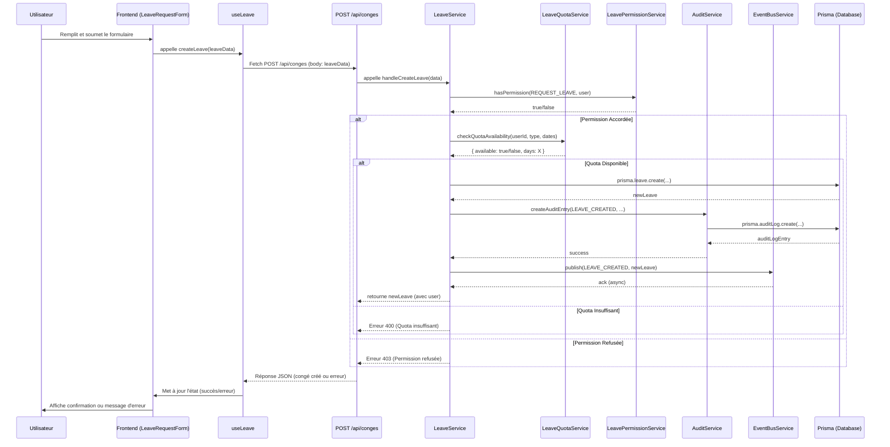
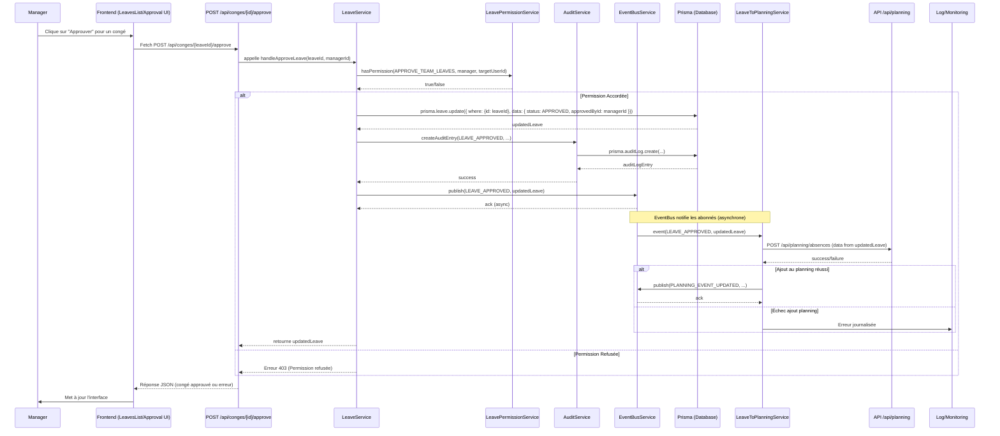

# Documentation de l'Architecture d'Intégration du Module de Congés

Ce document détaille comment le module de gestion des congés (`leaves`) s'intègre avec les autres parties de l'application Mathildanesth, en mettant l'accent sur les interactions, les interfaces et les mécanismes de communication.

## 1. Schéma d'Architecture Globale

Le schéma ci-dessous illustre les principaux modules et services impliqués dans la gestion des congés et leurs interactions :

```mermaid
graph TD
    subgraph Frontend
        UI_LeaveForm[LeaveRequestForm] -- Utilise --> Hook_useLeave(useLeave)
        UI_LeavesList[LeavesList] -- Affiche --> Hook_useLeave
        UI_Planning[PlanningView] -- Affiche congés --> API_Leaves(GET /api/conges)
        UI_Calendar[CalendarWidget] -- Affiche congés --> API_Leaves
        UI_LeaveConflict[LeaveConflictDashboard] -- Analyse conflits --> API_Conflicts(GET /api/conflicts)
        Hook_useLeave -- Appelle --> API_Leaves
        Hook_useLeave -- Appelle --> API_Leaves_ID(API /api/conges/[id])
        Hook_useLeave -- Utilise --> Hook_useConflict(useConflictDetection)
        Hook_useConflict -- Appelle --> API_Conflicts
        UI_LeaveForm -- Notifie --> Hook_useLeaveNotif(useLeaveNotifications)
        UI_LeavesList -- Notifie --> Hook_useLeaveNotif
        Hook_useLeaveNotif -- S'abonne --> EventBusClient[EventBus (Client-side)]
    end

    subgraph Backend
        subgraph API_Layer [API Layer (Next.js Route Handlers)]
            API_Leaves(GET /api/conges) -- Lit --> DB[(Prisma ORM)]
            API_Leaves_ID(POST /api/conges/[id]/...) -- Appelle --> LeaveService
            API_Leaves(POST /api/conges) -- Appelle --> LeaveService
            API_QuotaTransferRules(GET /api/conges/quota-transfers/rules/[type]) -- Lit --> DB
            API_Conflicts(GET /api/conflicts) -- Appelle --> ConflictService[Conflict Detection Service]
            API_Audit(POST /api/audit) -- Écrit --> DB
            API_Users(GET /api/utilisateurs/[id]) -- Lit --> DB
        end

        subgraph Services_Layer [Services Layer]
            LeaveService -- Utilise --> DB
            LeaveService -- Publie --> EventBus((EventBusService))
            LeaveService -- Vérifie --> PermissionService(LeavePermissionService)
            LeaveService -- Journalise --> AuditSvc(AuditService)
            LeaveService -- Appelle --> QuotaService[LeaveQuotaService]

            QuotaService -- Utilise --> DB
            QuotaService -- Publie --> EventBus
            QuotaService -- Journalise --> AuditSvc

            PermissionService -- Lit --> DB
            PermissionService -- Écoute --> EventBus

            AuditSvc -- Écrit --> DB
            AuditSvc -- Écoute --> EventBus

            ConflictService -- Lit --> DB
            ConflictService -- Lit --> API_Planning(API /api/planning)

            PlanningIntegrationSvc(LeaveToPlanningService) -- Écoute --> EventBus
            PlanningIntegrationSvc -- Appelle --> API_Planning
            PlanningIntegrationSvc -- Publie --> EventBus

            NotificationEventSvc(NotificationEventService) -- Écoute --> EventBus
            NotificationEventSvc -- Appelle --> NotificationSvc[NotificationService]

            LeaveReportApiSvc(LeaveReportApi) -- Lit --> DB
        end

        subgraph Core_Integration [Core Integration]
             EventBus((EventBusService))
        end
    end

    UI_LeaveForm --> API_Leaves(POST /api/conges)
    UI_LeavesList -- Actions (Approve, Cancel) --> API_Leaves_ID

    API_Leaves_ID -- Interagit avec --> DB
    API_Leaves_ID -- Publie événements --> EventBus

    EventBus -- Notifie --> PlanningIntegrationSvc
    EventBus -- Notifie --> AuditSvc
    EventBus -- Notifie --> PermissionService
    EventBus -- Notifie --> NotificationEventSvc
    EventBus -- Notifie --> EventBusClient

    AuditSvc -- Appelle --> API_Audit

    style DB fill:#f9f,stroke:#333,stroke-width:2px
    style EventBus fill:#ccf,stroke:#333,stroke-width:2px
```

**Description des flux principaux :**

1.  **Demande de congé :**
    *   L'utilisateur soumet via `LeaveRequestForm`.
    *   Le hook `useLeave` appelle l'API `POST /api/conges`.
    *   Le handler API valide les données et appelle `LeaveService`.
    *   `LeaveService` vérifie les quotas (`QuotaService`), les permissions (`PermissionService`), crée l'entrée `Leave` dans la base de données via Prisma, journalise l'action (`AuditService`) et publie un événement `LEAVE_CREATED` sur l'`EventBusService`.
2.  **Approbation de congé :**
    *   Un manager approuve via `LeavesList` (ou une interface dédiée).
    *   L'API `POST /api/conges/[id]/approve` est appelée.
    *   Le handler appelle `LeaveService`.
    *   `LeaveService` met à jour le statut du congé, vérifie les permissions, journalise et publie `LEAVE_APPROVED`.
3.  **Synchronisation avec le Planning :**
    *   `LeaveToPlanningService` écoute les événements `LEAVE_APPROVED` et `LEAVE_CANCELLED` (entre autres).
    *   Lorsqu'un congé est approuvé, il appelle l'API du planning (`/api/planning`) pour ajouter l'événement d'absence.
    *   Lorsqu'un congé est annulé/rejeté, il appelle l'API du planning pour supprimer l'événement.
4.  **Notifications :**
    *   `NotificationEventService` écoute les événements pertinents (`LEAVE_APPROVED`, `LEAVE_REJECTED`, `QUOTA_LOW`, etc.).
    *   Il appelle `NotificationService` pour générer et envoyer les notifications (via différents canaux : UI, email...).
    *   Côté client, `useLeaveNotifications` s'abonne au bus d'événements (version client) pour afficher les notifications en temps réel.
5.  **Audit :**
    *   `AuditService` écoute la plupart des événements d'intégration (`LEAVE_*`, `QUOTA_*`, `PERMISSION_*`) et reçoit des appels directs des services pour les actions spécifiques.
    *   Il formate et enregistre les entrées d'audit dans la table `AuditLog` via Prisma (ou potentiellement via une API dédiée `/api/audit`).
6.  **Permissions :**
    *   `LeavePermissionService` est appelé par les services (ex: `LeaveService`) avant les actions sensibles.
    *   Il vérifie les rôles et les permissions personnalisées (potentiellement mises en cache) stockées en base de données.
    *   Il écoute les événements de changement de rôle ou de permission pour invalider son cache.

## 2. Interfaces d'Intégration Détaillées

### 2.1 API REST

Le module de congés expose plusieurs points d'API REST sous `/api/conges/` :

*   **`GET /api/conges?userId={userId}` :**
    *   **Rôle :** Récupérer la liste des congés pour un utilisateur spécifique.
    *   **Paramètres :** `userId` (obligatoire).
    *   **Réponse :** Tableau d'objets `LeaveWithUserFrontend` (voir `src/app/api/conges/route.ts`).
    *   **Intégration :** Utilisé par le frontend (`LeavesList`, `PlanningView`, `CalendarWidget`) pour afficher les congés.
*   **`POST /api/conges` :**
    *   **Rôle :** Créer une nouvelle demande de congé.
    *   **Corps (Body) :** `{ userId: number, startDate: string (ISO), endDate: string (ISO), typeCode: string, reason?: string }`.
    *   **Réponse :** L'objet `LeaveWithUserFrontend` nouvellement créé.
    *   **Intégration :** Appelé par `LeaveRequestForm` via le hook `useLeave`. Déclenche la logique de service (validation, quotas, permissions, audit, événement `LEAVE_CREATED`).
*   **`GET /api/conges/[id]` :** (Implémentation à vérifier/confirmer)
    *   **Rôle :** Récupérer les détails d'un congé spécifique.
    *   **Paramètres :** `id` du congé dans l'URL.
    *   **Réponse :** Objet `LeaveWithUserFrontend`.
    *   **Intégration :** Utilisé potentiellement par le frontend pour afficher/éditer un congé.
*   **`PUT /api/conges/[id]` :** (Implémentation à vérifier/confirmer)
    *   **Rôle :** Mettre à jour un congé existant.
    *   **Paramètres :** `id` du congé dans l'URL.
    *   **Corps (Body) :** Champs à mettre à jour (`startDate`, `endDate`, `typeCode`, `reason`).
    *   **Réponse :** L'objet `LeaveWithUserFrontend` mis à jour.
    *   **Intégration :** Appelé lors de la modification d'un congé. Déclenche `LEAVE_UPDATED`.
*   **`POST /api/conges/[id]/approve` :** (Implémentation à vérifier/confirmer)
    *   **Rôle :** Approuver une demande de congé.
    *   **Paramètres :** `id` du congé dans l'URL.
    *   **Réponse :** L'objet `LeaveWithUserFrontend` mis à jour avec le statut `APPROVED`.
    *   **Intégration :** Appelé par les managers. Déclenche `LEAVE_APPROVED`.
*   **`POST /api/conges/[id]/reject` :** (Implémentation à vérifier/confirmer)
    *   **Rôle :** Rejeter une demande de congé.
    *   **Paramètres :** `id` du congé dans l'URL.
    *   **Corps (Body) :** `{ reason?: string }`.
    *   **Réponse :** L'objet `LeaveWithUserFrontend` mis à jour avec le statut `REJECTED`.
    *   **Intégration :** Appelé par les managers. Déclenche `LEAVE_REJECTED`.
*   **`POST /api/conges/[id]/cancel` :** (Implémentation à vérifier/confirmer)
    *   **Rôle :** Annuler un congé (par l'utilisateur ou un admin).
    *   **Paramètres :** `id` du congé dans l'URL.
    *   **Réponse :** L'objet `LeaveWithUserFrontend` mis à jour avec le statut `CANCELLED`.
    *   **Intégration :** Appelé par l'utilisateur ou les admins. Déclenche `LEAVE_CANCELLED`.
*   **`DELETE /api/conges/[id]` :** (Implémentation à vérifier/confirmer)
    *   **Rôle :** Supprimer un congé (action administrative).
    *   **Paramètres :** `id` du congé dans l'URL.
    *   **Réponse :** Statut 204 (No Content) ou confirmation.
    *   **Intégration :** Appelé par les admins. Déclenche `LEAVE_DELETED`.
*   **`GET /api/conges/quota-transfers/rules/[sourceType]` :**
    *   **Rôle :** Récupérer les règles de transfert de quota pour un type de congé source donné.
    *   **Paramètres :** `sourceType` (enum `LeaveType`) dans l'URL.
    *   **Réponse :** Tableau d'objets représentant les `QuotaTransferRule` applicables.
    *   **Intégration :** Utilisé par l'interface de gestion des transferts de quotas.
*   **Autres API potentielles :**
    *   `/api/conges/quotas` (pour gérer les soldes)
    *   `/api/conges/types` (pour gérer les types de congés)
    *   `/api/conges/reports` (via `LeaveReportApi`)

### 2.2 Événements d'Intégration (via `EventBusService`)

Le `EventBusService` (`src/modules/integration/services/EventBusService.ts`) centralise la communication asynchrone entre modules. Le module de congés publie et écoute plusieurs types d'événements définis dans `IntegrationEventType`.

**Format d'un Événement :**

```typescript
interface IntegrationEvent<T = any> {
    type: IntegrationEventType;  // Type d'événement (enum)
    payload: T;                  // Données spécifiques à l'événement
    timestamp: number;           // Horodatage (Date.now())
    source: string;              // Module émetteur (ex: 'leaves.service', 'planning.service')
    correlationId?: string;      // ID optionnel pour suivre une transaction
    userId?: string;             // ID de l'utilisateur concerné (si applicable)
}
```

**Événements Publiés par le Module `leaves` :**

*   `LEAVE_CREATED`: Lorsqu'une nouvelle demande est créée. `payload` contient l'objet `Leave`.
*   `LEAVE_UPDATED`: Lorsqu'un congé est modifié. `payload` contient l'objet `Leave` mis à jour.
*   `LEAVE_APPROVED`: Lorsqu'un congé est approuvé. `payload` contient l'objet `Leave`.
*   `LEAVE_REJECTED`: Lorsqu'un congé est rejeté. `payload` contient l'objet `Leave`.
*   `LEAVE_CANCELLED`: Lorsqu'un congé est annulé. `payload` contient l'objet `Leave`.
*   `LEAVE_DELETED`: Lorsqu'un congé est supprimé. `payload` contient l'ID du congé supprimé (ou l'objet avant suppression).
*   `QUOTA_UPDATED`: Lorsqu'un solde de quota est recalculé/modifié. `payload` contient `{ userId, leaveType, newBalance, changeAmount }`.
*   `QUOTA_TRANSFERRED`: Lorsqu'un transfert de quota a lieu. `payload` contient les détails du transfert (`fromType`, `toType`, `amount`, `userId`).
*   `QUOTA_CARRIED_OVER`: Lorsqu'un report de quota est effectué. `payload` contient les détails (`leaveType`, `amount`, `userId`, `year`).
*   `AUDIT_ACTION`: Utilisé pour publier des événements d'audit spécifiques qui ne correspondent pas directement à un événement métier standard (ex: `PERMISSION_GRANTED`, `PERMISSION_REVOKED`). `payload` contient l'objet `AuditEntry`.

**Événements Écoutés par le Module `leaves` (ou ses services associés) :**

*   `PLANNING_EVENT_UPDATED` / `PLANNING_EVENT_DELETED` (par `LeaveToPlanningService`): Pour détecter des changements dans le planning qui pourraient affecter un congé.
*   `USER_ROLE_CHANGED` (par `LeavePermissionService`): Pour invalider le cache des permissions.
*   Potentiellement d'autres événements liés aux utilisateurs ou à la configuration globale.

## 3. Guide d'Utilisation du Bus d'Événements (`EventBusService`)

Le `EventBusService` est un singleton accessible via `EventBusService.getInstance()` ou l'export `eventBus`.

**Fonctionnement :**

*   **Publication/Abonnement (Pub/Sub) :** Les modules peuvent publier des événements sans connaître les modules qui les écouteront, et vice-versa.
*   **Asynchrone :** Par défaut, les handlers d'événements sont appelés de manière asynchrone (`await Promise.resolve(handler(event))`) pour ne pas bloquer l'émetteur.
*   **File d'attente (Queueing) :** Pour les événements à haute fréquence (configurables via `queueConfig.highFrequencyEventTypes`, ex: `PLANNING_EVENT_UPDATED`, `AUDIT_ACTION`), les événements sont ajoutés à une file d'attente interne et traités par lots à intervalles réguliers (`queueConfig.processingInterval`) pour éviter de surcharger le système.
*   **Singleton :** Une seule instance du bus existe dans l'application backend.
*   **Debug :** En mode développement, des logs détaillés sont affichés dans la console.
*   **Historique :** Conserve un historique limité des derniers événements (`getEventHistory`).
*   **Statistiques :** Fournit des statistiques d'utilisation (`getStats`).

**Exemples Concrets :**

**a) Publier un événement (depuis un service) :**

```typescript
// src/modules/conges/services/LeaveService.ts
import { eventBus, IntegrationEventType } from '@/modules/integration/services/EventBusService';
import { Leave } from '@prisma/client'; // Ou votre type Leave

// ... dans une méthode après avoir approuvé un congé ...
const approvedLeave: Leave = /* ... résultat de prisma.leave.update ... */;
const userIdPerformingAction = /* ... ID de l'utilisateur manager ... */;

eventBus.publish<Leave>({ // Spécifier le type du payload
    type: IntegrationEventType.LEAVE_APPROVED,
    payload: approvedLeave,
    source: 'leaves.service', // Identifier la source
    userId: String(approvedLeave.userId), // ID de l'utilisateur dont le congé est approuvé
    correlationId: `leave-${approvedLeave.id}-approval` // Optionnel: pour suivi
});

console.log(`Événement LEAVE_APPROVED publié pour le congé ${approvedLeave.id}`);
```

**b) S'abonner à un événement (dans un service d'intégration) :**

```typescript
// src/modules/integration/services/LeaveToPlanningService.ts
import { eventBus, IntegrationEventType, IntegrationEvent } from '@/modules/integration/services/EventBusService';
import { Leave } from '@prisma/client';

export class LeaveToPlanningService {
    private unsubscribeCallbacks: (() => void)[] = [];

    constructor(/* ... dépendances ... */) {
        this.subscribeToLeaveEvents();
    }

    private subscribeToLeaveEvents(): void {
        const unsubscribeApprove = eventBus.subscribe<Leave>(
            IntegrationEventType.LEAVE_APPROVED,
            this.handleLeaveApproved.bind(this) // Lier le contexte 'this'
        );
        this.unsubscribeCallbacks.push(unsubscribeApprove);

        const unsubscribeCancel = eventBus.subscribe<Leave>(
            IntegrationEventType.LEAVE_CANCELLED,
            this.handleLeaveCancelled.bind(this)
        );
        this.unsubscribeCallbacks.push(unsubscribeCancel);

        // ... s'abonner à d'autres événements si nécessaire ...

        console.log('[LeaveToPlanningService] Abonnements aux événements de congé actifs.');
    }

    private async handleLeaveApproved(event: IntegrationEvent<Leave>): Promise<void> {
        const leave = event.payload;
        console.log(`[LeaveToPlanningService] Congé approuvé détecté: ${leave.id}, userId: ${event.userId}`);
        try {
            // Logique pour ajouter l'événement au planning
            // await planningApiService.addAbsence(leave.userId, leave.startDate, leave.endDate, leave.id);
            console.log(`[LeaveToPlanningService] Absence ajoutée au planning pour le congé ${leave.id}`);

            // Publier un événement si le planning a été mis à jour
            eventBus.publish({
                type: IntegrationEventType.PLANNING_EVENT_UPDATED,
                payload: { userId: leave.userId, dates: [leave.startDate, leave.endDate] },
                source: 'integration.leaveToPlanningService',
                userId: String(leave.userId)
            });

        } catch (error) {
            console.error(`[LeaveToPlanningService] Erreur lors de l'ajout au planning pour le congé ${leave.id}:`, error);
            // Ajouter une logique de retry ou de notification d'erreur
        }
    }

    private async handleLeaveCancelled(event: IntegrationEvent<Leave>): Promise<void> {
        const leave = event.payload;
        console.log(`[LeaveToPlanningService] Congé annulé détecté: ${leave.id}, userId: ${event.userId}`);
        try {
            // Logique pour supprimer l'événement du planning
            // await planningApiService.removeAbsenceForLeave(leave.id);
             console.log(`[LeaveToPlanningService] Absence retirée du planning pour le congé ${leave.id}`);

             // Publier un événement si le planning a été mis à jour
             // ... (similaire à handleLeaveApproved)
        } catch (error) {
             console.error(`[LeaveToPlanningService] Erreur lors de la suppression du planning pour le congé ${leave.id}:`, error);
        }
    }

    // Méthode pour nettoyer les abonnements lors de la destruction du service
    public dispose(): void {
        this.unsubscribeCallbacks.forEach(unsubscribe => unsubscribe());
        console.log('[LeaveToPlanningService] Abonnements nettoyés.');
    }
}
```

**c) S'abonner à tous les événements (pour logging/debug) :**

```typescript
// Peut être utilisé dans un service de monitoring ou pour le debug
import { eventBus, IntegrationEvent } from '@/modules/integration/services/EventBusService';

const unsubscribeAll = eventBus.subscribeToAll((event: IntegrationEvent) => {
    console.log(`[Event Monitor] Event received: ${event.type} from ${event.source}`, event.payload);
});

// Ne pas oublier de se désabonner si nécessaire
// unsubscribeAll();
```

## 4. Documentation du Système de Permissions et d'Audit

### 4.1 Permissions (`LeavePermissionService`)

Le `LeavePermissionService` (`src/modules/conges/permissions/LeavePermissionService.ts`) centralise la logique de contrôle d'accès pour le module de congés.

**Concepts Clés :**

*   **Permissions Granulaires :** Définies dans l'enum `LeavePermission` (ex: `REQUEST_LEAVE`, `APPROVE_TEAM_LEAVES`, `MANAGE_QUOTAS`).
*   **Rôles Prédéfinis :** Des rôles (`LeaveRole`) mappent vers des ensembles de permissions par défaut (ex: `EMPLOYEE`, `TEAM_MANAGER`, `HR_ADMIN`). Le système mappe également les rôles génériques de l'application (`UTILISATEUR`, `MANAGER`, `ADMIN_PARTIEL`, `ADMIN_TOTAL`) vers ces permissions spécifiques aux congés.
*   **Permissions Personnalisées :** Possibilité d'accorder (`grantPermission`) ou de révoquer (`revokePermission`) des permissions spécifiques à un utilisateur, outrepassant les permissions de son rôle. Ces permissions sont stockées (mécanisme à confirmer, potentiellement DB ou fichier de config).
*   **Vérification :** La méthode principale est `hasPermission(permission, user?, targetUserId?, targetDepartmentId?)`. Elle vérifie les refus explicites, les accords explicites, puis les permissions du rôle. Pour les permissions relatives (ex: `APPROVE_TEAM_LEAVES`), elle peut nécessiter des vérifications supplémentaires (appartenance à l'équipe/département).
*   **Cache :** Un cache en mémoire (configurable) stocke les résultats des vérifications de `hasPermission` pour améliorer les performances. Le cache est invalidé automatiquement lors de changements de permissions détectés via le bus d'événements (`PERMISSION_GRANTED`, `PERMISSION_REVOKED`, `USER_ROLE_CHANGED`).
*   **Intégration Audit/EventBus :** Les modifications de permissions (accord/révocation) sont journalisées via `AuditService` et publient un événement `AUDIT_ACTION` sur le bus.

**Cas d'Utilisation :**

*   **Un employé demande un congé :**
    *   Le `LeaveService`, avant de créer le congé, appelle `leavePermissionService.hasPermission(LeavePermission.REQUEST_LEAVE, currentUser)`.
*   **Un manager approuve un congé pour son équipe :**
    *   L'API `/api/conges/[id]/approve`, via `LeaveService`, appelle `leavePermissionService.hasPermission(LeavePermission.APPROVE_TEAM_LEAVES, currentUser, targetUserId)`. Le `targetUserId` est l'ID de l'employé dont le congé est approuvé. `checkRelativePermission` vérifiera si `targetUserId` est dans l'équipe de `currentUser`.
*   **Un admin RH gère les quotas :**
    *   L'interface de gestion des quotas, via le service `QuotaService`, appelle `leavePermissionService.hasPermission(LeavePermission.MANAGE_QUOTAS, currentUser)`.
*   **Un admin système accorde une permission spéciale :**
    *   L'interface d'administration appelle `leavePermissionService.grantPermission(userId, LeavePermission.CANCEL_ANY_LEAVE)`. Le service vérifie si l'admin a `MANAGE_LEAVE_RULES`, met à jour les permissions personnalisées, invalide le cache, journalise l'action et publie un événement.

### 4.2 Audit (`AuditService`)

Le `AuditService` (implémentations trouvées dans `src/lib/auditService.ts` et `src/modules/conges/services/AuditService.ts` - vérifier quelle est la version canonique) est responsable de la journalisation des actions importantes.

**Concepts Clés :**

*   **Actions Auditées :** Définies dans l'enum `AuditActionType` (ou `AuditAction` selon l'implémentation). Couvrent les opérations CRUD sur les congés, les modifications de quotas, les changements de permissions, etc.
*   **Entrée d'Audit :** Une entrée typique (`AuditEntry` ou `AuditLogParams`) contient :
    *   `actionType` / `action`: Le type d'action.
    *   `userId`: L'ID de l'utilisateur ayant effectué l'action.
    *   `targetId` / `entityId`: L'ID de l'entité affectée (ex: ID du congé, ID de l'utilisateur).
    *   `targetType` / `entityType`: Le type d'entité (ex: 'leave', 'user', 'quota').
    *   `timestamp`: Horodatage de l'action.
    *   `description`: Description textuelle de l'action.
    *   `severity`: Niveau de criticité (INFO, LOW, MEDIUM, HIGH).
    *   `metadata` / `details`: Données contextuelles supplémentaires (ex: anciennes et nouvelles valeurs).
*   **Journalisation :**
    *   **Automatique :** Le service s'abonne aux événements pertinents du `EventBusService` (`LEAVE_*`, `QUOTA_*`, `AUDIT_ACTION` avec type `PERMISSION_*`) et crée automatiquement des entrées d'audit.
    *   **Manuelle :** Les services peuvent appeler directement `auditService.createAuditEntry()` (ou `logAction`) pour des actions non couvertes par les événements ou nécessitant des détails spécifiques.
*   **Stockage :** Les logs sont persistés dans la table `AuditLog` de la base de données via Prisma (ou potentiellement via une API `/api/audit`).
*   **Consultation :** Des méthodes comme `searchAuditEntries`, `getAuditEntry`, `getActionsForEntity` permettent de récupérer les logs d'audit pour consultation ou analyse.

**Cas d'Utilisation :**

*   **Suivi d'une demande de congé :** Rechercher toutes les entrées d'audit avec `entityType='leave'` et `entityId={leaveId}` pour voir quand elle a été créée, approuvée, modifiée, etc., et par qui.
*   **Vérification des actions d'un admin :** Rechercher toutes les entrées d'audit avec `userId={adminUserId}` pour voir quelles actions sensibles il a effectuées.
*   **Analyse des modifications de quotas :** Filtrer les entrées d'audit par `actionType=QUOTA_UPDATED` ou `QUOTA_TRANSFERRED` pour comprendre les ajustements de soldes.
*   **Sécurité :** Surveiller les actions critiques comme `PERMISSION_GRANTED`, `PERMISSION_REVOKED`, `DELETE_LEAVE`.

## 5. Diagrammes de Séquence (Flux Principaux)

### 5.1 Demande de Congé



### 5.2 Approbation de Congé et Synchronisation Planning



## 6. Glossaire des Termes Techniques

*   **EventBusService :** Service central (Singleton) basé sur le pattern Pub/Sub pour la communication asynchrone entre modules via des événements.
*   **IntegrationEvent :** Structure de données standard pour les événements transitant par l'`EventBusService`. Contient type, payload, source, timestamp, etc.
*   **IntegrationEventType :** Enumération des types d'événements standards utilisés pour l'intégration inter-modules (ex: `LEAVE_APPROVED`, `QUOTA_UPDATED`).
*   **LeaveService :** Service principal du module `leaves`, orchestrant la logique métier pour la création, modification, approbation des congés.
*   **LeavePermissionService :** Service gérant le contrôle d'accès granulaire (permissions) pour les fonctionnalités liées aux congés.
*   **LeavePermission :** Enumération des permissions spécifiques au module de congés (ex: `REQUEST_LEAVE`, `MANAGE_QUOTAS`).
*   **AuditService :** Service responsable de la journalisation des actions sensibles dans un log d'audit.
*   **AuditActionType / AuditAction :** Enumération des types d'actions enregistrées dans l'audit (ex: `LEAVE_CREATED`, `PERMISSION_GRANTED`).
*   **AuditEntry / AuditLog :** Enregistrement individuel dans le journal d'audit.
*   **LeaveToPlanningService :** Service d'intégration spécifique qui écoute les événements de congé et met à jour le module de planning en conséquence.
*   **QuotaTransferRule :** Modèle de données (Prisma) définissant les règles de transfert de quotas entre différents types de congés.
*   **LeaveQuotaService :** Service gérant la logique de calcul, de vérification et de mise à jour des soldes de congés (quotas).
*   **Prisma :** ORM (Object-Relational Mapper) utilisé pour interagir avec la base de données PostgreSQL.
*   **API Route Handler :** Fonction Next.js (dans `src/app/api/...`) qui gère les requêtes HTTP pour un chemin spécifique.

## 7. Exemples de Code pour l'Intégration avec de Nouveaux Modules

### Exemple 1: Un nouveau module "Formation" qui doit réagir à l'approbation d'un congé "Formation"

```typescript
// src/modules/training/services/TrainingIntegrationService.ts
import { eventBus, IntegrationEventType, IntegrationEvent } from '@/modules/integration/services/EventBusService';
import { Leave, LeaveType } from '@prisma/client'; // Importer les types nécessaires
// Supposer l'existence d'un service pour gérer les inscriptions aux formations
import { trainingEnrollmentService } from './TrainingEnrollmentService';
import { auditService, AuditActionType, AuditSeverity } from '@/modules/conges/services/AuditService'; // Utiliser le service d'audit

export class TrainingIntegrationService {
    private unsubscribeCallback: (() => void) | null = null;

    constructor() {
        this.subscribeToLeaveApproval();
    }

    private subscribeToLeaveApproval(): void {
        this.unsubscribeCallback = eventBus.subscribe<Leave>(
            IntegrationEventType.LEAVE_APPROVED,
            this.handleLeaveApproved.bind(this)
        );
        console.log('[TrainingIntegrationService] Abonné à LEAVE_APPROVED.');
    }

    private async handleLeaveApproved(event: IntegrationEvent<Leave>): Promise<void> {
        const leave = event.payload;

        // Vérifier si c'est un congé de type FORMATION
        if (leave.type === LeaveType.TRAINING) { // Utiliser l'enum Prisma
            console.log(`[TrainingIntegrationService] Congé formation approuvé détecté: ${leave.id}, pour userId: ${leave.userId}`);

            try {
                // Logique métier : Inscrire automatiquement l'utilisateur à la formation?
                // Note: Le 'reason' ou un champ spécifique pourrait contenir l'ID de la formation
                const trainingId = leave.reason; // Supposition simpliste
                if (trainingId) {
                    await trainingEnrollmentService.enrollUser(leave.userId, trainingId, {
                        startDate: leave.startDate,
                        endDate: leave.endDate
                    });
                    console.log(`[TrainingIntegrationService] Utilisateur ${leave.userId} inscrit à la formation ${trainingId}`);

                    // Journaliser l'action via AuditService
                    await auditService.createAuditEntry({
                        actionType: AuditActionType.SYSTEM_ACCESS, // Ou un type plus spécifique si défini
                        userId: 'system', // Ou l'ID de l'approbateur si disponible dans l'event
                        description: `[TrainingModule] Utilisateur ${leave.userId} automatiquement inscrit à la formation ${trainingId} suite à approbation congé ${leave.id}`,
                        targetId: String(leave.userId),
                        targetType: 'userTrainingEnrollment',
                        severity: AuditSeverity.INFO,
                        metadata: { leaveId: leave.id, trainingId: trainingId }
                    });

                } else {
                    console.warn(`[TrainingIntegrationService] Pas d'ID de formation trouvé dans le congé ${leave.id}`);
                }

            } catch (error) {
                console.error(`[TrainingIntegrationService] Erreur lors du traitement du congé formation ${leave.id}:`, error);
                // Ajouter une notification ou un log d'erreur plus robuste
            }
        }
    }

    public dispose(): void {
        if (this.unsubscribeCallback) {
            this.unsubscribeCallback();
            console.log('[TrainingIntegrationService] Désabonné de LEAVE_APPROVED.');
        }
    }
}

// Instancier et potentiellement exporter le service
export const trainingIntegrationService = new TrainingIntegrationService();

```

### Exemple 2: Un nouveau module "Reporting" qui a besoin de récupérer des données agrégées sur les congés

```typescript
// src/modules/reporting/services/LeaveReportService.ts
import { prisma } from '@/lib/prisma'; // Accès direct DB ou via une API dédiée
import { LeaveStatus, LeaveType } from '@prisma/client';
// Importer le service de permission pour vérifier l'accès aux rapports
import { leavePermissionService, LeavePermission } from '@/modules/conges/permissions/LeavePermissionService';
import { User } from '@/types/user'; // Type User

// Interface pour les données agrégées
interface LeaveReportData {
    totalApprovedDays: number;
    countByType: Record<LeaveType, number>;
    countByStatus: Record<LeaveStatus, number>;
    // ... autres métriques ...
}

export class LeaveReportService {

    // Méthode pour générer un rapport (exemple)
    async generateLeaveSummaryReport(requestingUser: User, startDate: Date, endDate: Date): Promise<LeaveReportData | null> {

        // 1. Vérifier la permission
        const canViewReports = await leavePermissionService.hasPermission(LeavePermission.VIEW_REPORTS, requestingUser);
        if (!canViewReports) {
            console.error(`[LeaveReportService] L'utilisateur ${requestingUser.id} n'a pas la permission VIEW_REPORTS.`);
            throw new Error("Permission refusée pour accéder aux rapports de congés.");
            // Ou retourner null / gérer l'erreur autrement
        }

        console.log(`[LeaveReportService] Génération du rapport pour la période ${startDate.toISOString()} - ${endDate.toISOString()}`);

        try {
            // 2. Requête Prisma pour agréger les données
            // Note : Ceci est un exemple, les agrégations Prisma peuvent être plus complexes
            const approvedLeaves = await prisma.leave.findMany({
                where: {
                    status: LeaveStatus.APPROVED,
                    startDate: { gte: startDate },
                    endDate: { lte: endDate },
                },
                select: {
                    countedDays: true,
                    type: true,
                }
            });

            const allLeavesInPeriod = await prisma.leave.findMany({
                 where: {
                    // On pourrait filtrer plus largement pour countByStatus
                    OR: [
                       { startDate: { lte: endDate }, endDate: { gte: startDate } }, // chevauchement
                    ]
                },
                select: {
                    status: true,
                    type: true, // Inclure le type pour countByType
                }
            });

            // 3. Calculer les métriques
            const totalApprovedDays = approvedLeaves.reduce((sum, leave) => sum + (leave.countedDays || 0), 0);

            const countByType = {} as Record<LeaveType, number>;
            const countByStatus = {} as Record<LeaveStatus, number>;

            // Initialiser les compteurs
            Object.values(LeaveType).forEach(lt => { countByType[lt] = 0; });
            Object.values(LeaveStatus).forEach(ls => { countByStatus[ls] = 0; });

            allLeavesInPeriod.forEach(leave => {
                if (leave.status) {
                    countByStatus[leave.status]++;
                }
                 if (leave.type) { // Ajouter le comptage par type
                    countByType[leave.type]++;
                }
            });

            const reportData: LeaveReportData = {
                totalApprovedDays,
                countByType,
                countByStatus,
            };

            // 4. Journaliser l'action (optionnel, mais recommandé)
            // await auditService.createAuditEntry({...});

            return reportData;

        } catch (error) {
            console.error("[LeaveReportService] Erreur lors de la génération du rapport:", error);
            throw error; // Renvoyer l'erreur pour une gestion supérieure
        }
    }
}

export const leaveReportService = new LeaveReportService();
```

</rewritten_file> 