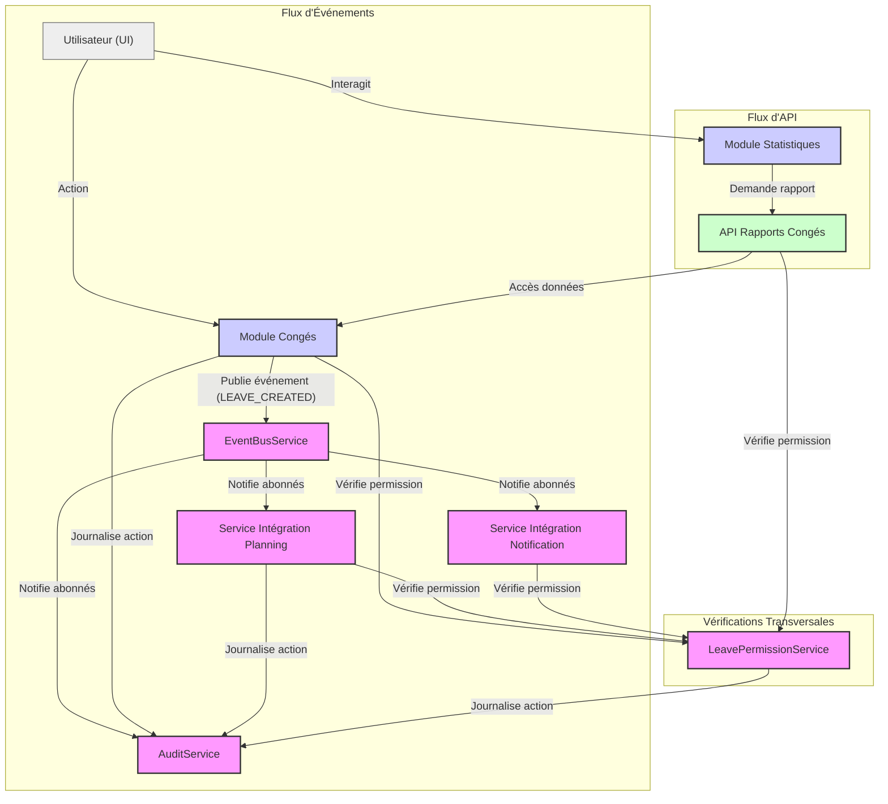

# Architecture d'intégration du module de congés

Ce document détaille l'architecture d'intégration du module de congés avec les autres modules de l'application, en mettant l'accent sur le bus d'événements, l'audit et la gestion des permissions.

## Vue d'ensemble

L'architecture d'intégration repose sur plusieurs principes clés :

1. **Couplage faible** : Les modules communiquent via un bus d'événements central (`EventBusService`) sans créer de dépendances directes.
2. **Séparation des préoccupations** : Chaque service a une responsabilité unique et bien définie.
3. **Traçabilité** : Toutes les actions importantes sont journalisées via `AuditService`.
4. **Contrôle d'accès** : Les accès sont gérés de manière granulaire par `LeavePermissionService`.
5. **Extensibilité** : L'architecture permet d'ajouter facilement de nouveaux modules et fonctionnalités.

## Composants principaux

### EventBusService

Service central basé sur le pattern **Singleton** et **Observer** pour la communication inter-modules.

**Responsabilités** :
- Gestion centralisée des abonnements aux types d'événements (`IntegrationEventType`).
- Publication d'événements (`IntegrationEvent`) avec payload, source, timestamp, et IDs optionnels (utilisateur, corrélation).
- File d'attente pour les événements à haute fréquence (traitement par lots).
- Historique configurable des événements récents.
- Gestion des erreurs dans les gestionnaires d'événements.
- Statistiques sur les événements et la file d'attente.
- Méthodes `subscribe`, `publish`, `configureQueue`, `getEventHistory`, `getStats`, `dispose`.

### AuditService

Service **Singleton** responsable de la journalisation des actions sensibles pour la sécurité et la conformité.

**Responsabilités** :
- Journalisation d'actions prédéfinies (`AuditActionType`) avec différents niveaux de sévérité (`AuditSeverity`).
- S'abonne aux événements pertinents du `EventBusService` (congés, quotas, audit) pour créer automatiquement des entrées d'audit.
- Fournit une API CRUD (`/api/audit/entries`) pour les entrées d'audit (`AuditEntry`).
- Permet la recherche d'entrées d'audit avec filtres et pagination (`searchAuditEntries`).
- Offre des méthodes spécifiques pour journaliser des actions courantes (`logSystemAccess`, `logUserRoleChange`, `logPermissionChange`, etc.).
- Enrichit les entrées d'audit avec des informations contextuelles (IP, User-Agent).

### LeavePermissionService

Service **Singleton** gérant le contrôle d'accès granulaire pour le module de congés.

**Responsabilités** :
- Définition des permissions (`LeavePermission`) et des rôles (`LeaveRole`).
- Mappage des rôles aux permissions par défaut.
- Gestion des permissions personnalisées par utilisateur (accordées/refusées) via une API (`/api/leaves/permissions`).
- Vérification des permissions (`hasPermission`, `hasPermissions`) pour un utilisateur donné, en tenant compte du rôle et des permissions personnalisées.
- Gestion des permissions relatives (ex: `APPROVE_TEAM_LEAVES` nécessite de vérifier si l'utilisateur cible est dans l'équipe).
- Cache configurable (`PermissionCacheConfig`) pour optimiser les vérifications de permissions.
- Invalidation automatique du cache lors de la modification des rôles ou des permissions (via `EventBusService`).
- Journalisation des modifications de permissions via `AuditService`.
- Méthodes `grantPermission`, `revokePermission`, `resetUserPermissions` pour la gestion des permissions personnalisées.

### Autres services d'intégration (Exemples)

- **LeaveToPlanningService** : S'abonne aux événements de congés (`LEAVE_CREATED`, `LEAVE_APPROVED`, etc.) et interagit avec le module de planning (création/mise à jour d'événements).
- **LeaveNotificationService** : S'abonne aux événements de congés et utilise un service de notification pour informer les utilisateurs concernés.
- **LeaveReportApi** : Fournit une interface API pour que d'autres modules (ex: Statistiques) puissent accéder aux données de congés agrégées, en respectant les permissions.

## Flux de données clés

### Création d'une demande de congé

1. **UI** : L'utilisateur soumet le formulaire de demande de congé.
2. **LeaveModule** : Valide la demande.
3. **LeaveModule** → `LeavePermissionService` : Vérifie si l'utilisateur a la permission `REQUEST_LEAVE`.
4. **LeaveModule** : Crée l'entrée de congé en base de données (statut `PENDING`).
5. **LeaveModule** → `EventBusService` : Publie un événement `LEAVE_CREATED` avec les détails du congé et l'ID utilisateur.
6. **EventBusService** → **Abonnés** :
    *   `AuditService` : Reçoit l'événement et appelle `createAuditEntry` (action `LEAVE_CREATED`, sévérité `INFO`).
    *   `LeaveToPlanningService` (si pertinent) : Reçoit l'événement, vérifie les permissions si nécessaire, et crée un événement provisoire dans le planning.
    *   `LeaveNotificationService` : Reçoit l'événement, identifie le manager, et envoie une notification de demande d'approbation.

### Approbation d'un congé

1. **UI** : Un manager approuve une demande de congé.
2. **LeaveModule** → `LeavePermissionService` : Vérifie si le manager a la permission `APPROVE_TEAM_LEAVES` (ou `APPROVE_DEPARTMENT_LEAVES`, `APPROVE_ALL_LEAVES`) pour l'utilisateur concerné.
3. **LeaveModule** : Met à jour le statut du congé en `APPROVED`.
4. **LeaveModule** → `EventBusService` : Publie un événement `LEAVE_APPROVED`.
5. **EventBusService** → **Abonnés** :
    *   `AuditService` : Reçoit l'événement et appelle `createAuditEntry` (action `LEAVE_APPROVED`, sévérité `LOW`).
    *   `LeaveToPlanningService` : Met à jour l'événement dans le planning (le confirme ou le rend définitif).
    *   `LeaveNotificationService` : Envoie une notification de confirmation à l'employé.
    *   **QuotaService** (hypothétique) : Reçoit l'événement et publie un `QUOTA_UPDATED` pour déduire les jours du quota de l'employé.
6. **EventBusService** → `AuditService` : Reçoit l'événement `QUOTA_UPDATED` et crée une entrée d'audit.

### Modification d'une permission utilisateur

1. **UI** : Un administrateur accorde la permission `VIEW_REPORTS` à un utilisateur.
2. **AdminModule** (ou `LeaveModule`) → `LeavePermissionService` : Appelle `grantPermission('user-123', LeavePermission.VIEW_REPORTS)`.
3. `LeavePermissionService` : Vérifie si l'administrateur a la permission de modifier les permissions.
4. `LeavePermissionService` : Met à jour les permissions personnalisées via l'API (`/api/leaves/permissions/user-123/grant`).
5. `LeavePermissionService` → `AuditService` : Appelle `logPermissionChange` pour journaliser l'octroi.
6. `LeavePermissionService` : Invalide le cache de permissions pour `user-123` (`invalidateUserCache`).
7. `AuditService` → `EventBusService` : L'appel à `logPermissionChange` peut potentiellement publier un événement `AUDIT_ACTION` (selon l'implémentation interne d'AuditService).
8. **EventBusService** → `LeavePermissionService` : Reçoit l'événement `AUDIT_ACTION` (si publié) et confirme l'invalidation du cache pour `user-123`.

## Considérations de sécurité

- **Permissions granulaires** : `LeavePermissionService` assure que seules les actions autorisées sont possibles.
- **Audit systématique** : `AuditService` trace toutes les actions sensibles et les modifications.
- **Validation des entrées** : Les API et services doivent valider toutes les données reçues.
- **Communication sécurisée** : Utiliser HTTPS pour toutes les communications API.
- **Gestion des secrets** : Les clés d'API ou autres secrets ne doivent pas être stockés dans le code.

## Extension de l'architecture

Pour ajouter un nouveau module :

1. **Créer un Service d'Intégration** : Dédié aux interactions avec les autres modules via le bus.
2. **Définir les Événements** : Identifier les `IntegrationEventType` pertinents à écouter ou publier.
3. **S'abonner/Publier** : Utiliser `eventBus.subscribe()` et `eventBus.publish()`.
4. **Gérer les Permissions** : Si nécessaire, interagir avec `LeavePermissionService` ou définir de nouvelles permissions.
5. **Intégrer l'Audit** : Appeler `AuditService` pour journaliser les actions propres au module.
6. **Documenter** : Mettre à jour ce document et le guide d'intégration. 