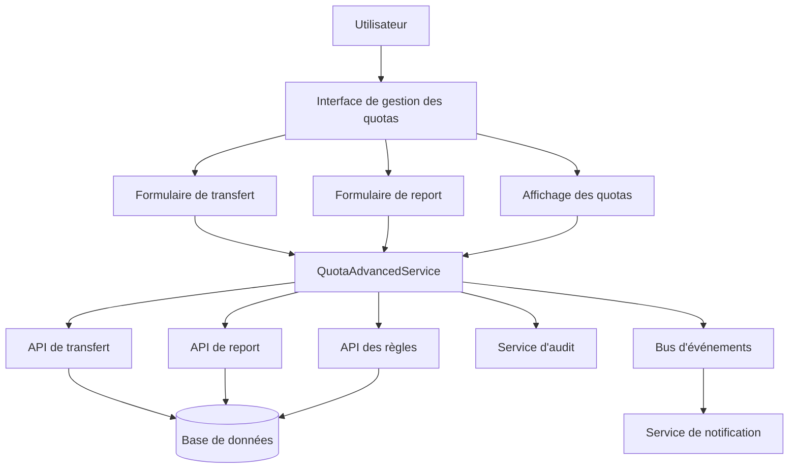

# Système avancé de transfert et report de quotas

Ce document présente l'architecture et le fonctionnement du système avancé de gestion des quotas de congés, permettant le transfert entre types de congés et le report d'une année sur l'autre.

## Table des matières

1. [Vue d'ensemble](#vue-densemble)
2. [Architecture du système](#architecture-du-système)
3. [Modèle de données](#modèle-de-données)
4. [Fonctionnalités principales](#fonctionnalités-principales)
5. [Règles métier](#règles-métier)
6. [Interface utilisateur](#interface-utilisateur)
7. [Intégration avec les systèmes existants](#intégration-avec-les-systèmes-existants)
8. [Tests](#tests)
9. [Considérations de sécurité](#considérations-de-sécurité)
10. [Extensions futures](#extensions-futures)

## Vue d'ensemble

Le système avancé de gestion des quotas permet aux utilisateurs de :

- Transférer des jours de congés entre différents types (ex: convertir des RTT en congés payés)
- Reporter des jours non utilisés d'une année sur l'autre avec gestion des règles d'expiration
- Visualiser l'historique et l'origine de leurs quotas (reportés, transférés)
- Recevoir des alertes pour les jours qui vont bientôt expirer

Les transferts et reports sont soumis à des règles configurables (ratios, limites, dates d'expiration) qui peuvent être personnalisées selon les politiques de l'entreprise.

## Architecture du système

Le système est composé des éléments suivants :

### Services

- `QuotaAdvancedService` : Service central gérant toute la logique métier
- `AuditService` : Service de journalisation pour la traçabilité des opérations
- `EventBusService` : Service de bus d'événements pour les notifications

### Composants UI

- `EnhancedQuotaDisplay` : Affichage détaillé des quotas avec informations de transfert/report
- `QuotaTransferForm` : Formulaire de transfert entre types de congés
- `QuotaCarryOverForm` : Formulaire de report sur l'année suivante
- `QuotaManagementPanel` : Panneau global intégrant les trois composants précédents

### APIs

- `/api/conges/quotas/transfer` : API de transfert de quotas
- `/api/conges/quotas/transfer/preview` : API de simulation de transfert
- `/api/conges/quotas/carry-over` : API de report de quotas
- `/api/conges/quotas/transfer-rules` : API de gestion des règles de transfert
- `/api/conges/quotas/carry-over-rules` : API de gestion des règles de report

## Modèle de données

Le système étend le modèle de données existant avec les structures suivantes :

### Règles de transfert

```typescript
interface QuotaTransferRule {
    id: string;
    sourceType: LeaveType;
    targetType: LeaveType;
    ratio: number;
    minAmount?: number;
    maxAmount?: number;
    startDate?: Date;
    endDate?: Date;
    bidirectional: boolean;
    type: QuotaTransferRuleType;
    description?: string;
}
```

### Règles de report

```typescript
interface QuotaCarryOverRule {
    id: string;
    name: string;
    description?: string;
    leaveType: LeaveType;
    ruleType: QuotaCarryOverRuleType;
    value: number;
    expiryMonths: number;
    deadlineMonth: number;
    deadlineDay: number;
    isActive: boolean;
    createdAt: Date;
    updatedAt: Date;
}
```

### État amélioré des quotas

```typescript
interface EnhancedQuotaState {
    type: LeaveType;
    total: number;
    used: number;
    pending: number;
    remaining: number;
    totalCarriedOver: number;
    totalTransferredIn: number;
    totalTransferredOut: number;
    carriedOverItems: { fromYear: number, amount: number, expiryDate?: Date }[];
    transferItems: { type: 'in' | 'out', relatedType: LeaveType, amount: number, date: Date }[];
    expiringCarryOver?: { amount: number, expiryDate: Date, daysUntilExpiry: number };
}
```

## Fonctionnalités principales

### 1. Transfert de quotas

Le transfert de quotas permet de convertir des jours d'un type de congé vers un autre, selon des règles configurables :

- Vérification des quotas disponibles
- Application de ratios de conversion (ex: 1 RTT = 0.8 CP)
- Respect des limites minimales et maximales
- Traçabilité complète des transferts
- Simulation préalable pour informer l'utilisateur

Processus complet :
1. L'utilisateur sélectionne le type source, le type cible et le montant
2. Le système simule le transfert en temps réel
3. L'utilisateur visualise le résultat et confirme
4. Le système applique le transfert et génère un événement
5. L'action est auditée dans le système

### 2. Report de quotas

Le report de quotas permet de transférer des jours non utilisés vers l'année suivante :

- Plusieurs types de règles de report (pourcentage, montant fixe, tout)
- Dates d'expiration configurables
- Limites de report par type de congé
- Visualisation claire de l'origine des jours et de leur date d'expiration

Processus complet :
1. L'utilisateur sélectionne le type de congé à reporter
2. Le système calcule automatiquement le montant reportable selon les règles
3. L'utilisateur confirme le report
4. Le système applique le report et génère un événement
5. L'action est auditée dans le système

### 3. Visualisation avancée

Le système offre une visualisation détaillée des quotas, incluant :

- Affichage des quotas standard (total, utilisé, en attente, restant)
- Historique des transferts effectués
- Historique des reports par année
- Alertes pour les jours qui vont bientôt expirer
- Statistiques globales sur l'utilisation des quotas

## Règles métier

### Règles de transfert

- Le transfert n'est possible que si l'utilisateur dispose de suffisamment de jours
- Les règles peuvent être limitées dans le temps (dates de début/fin)
- Des ratios différents peuvent être appliqués selon les types de congés concernés
- Des limites minimales et maximales peuvent être imposées
- Des règles spéciales peuvent être activées pour certaines périodes (été, fêtes)

### Règles de report

- Les reports peuvent être limités à un pourcentage du solde restant
- Les reports peuvent être limités à un nombre maximal de jours
- Les reports peuvent avoir une date d'expiration
- Les règles de report sont configurables par type de congé
- Si plusieurs règles s'appliquent, la plus avantageuse est utilisée

## Interface utilisateur

L'interface utilisateur est conçue pour être intuitive et informative :

- Onglets séparés pour la visualisation, le transfert et le report
- Formulaires interactifs avec validation en temps réel
- Simulations instantanées des opérations pour aider à la décision
- Alertes visuelles pour les quotas faibles et les jours qui expirent
- Historique détaillé des opérations effectuées

## Intégration avec les systèmes existants

Le système s'intègre avec les composants existants :

### Services

- Extension du service de quotas existant (`useLeaveQuota`)
- Intégration avec le service d'audit pour la traçabilité
- Utilisation du bus d'événements pour les notifications

### Composants UI

- Compatibilité avec les composants d'affichage existants
- Style cohérent avec les directives de l'interface utilisateur
- Extensibilité pour les futures fonctionnalités

### APIs

- Extension des APIs existantes
- Versionnement cohérent
- Gestion des erreurs standardisée

## Tests

Le système est couvert par différents types de tests :

### Tests unitaires

- Tests des règles de calcul de transfert et report
- Tests de validation des entrées utilisateur
- Tests des fonctions utilitaires

### Tests d'intégration

- Tests de l'intégration avec le service d'audit
- Tests de l'intégration avec le bus d'événements
- Tests de l'intégration avec les APIs

### Tests UI

- Tests des formulaires et de la validation
- Tests de l'affichage des données
- Tests des interactions utilisateur

## Considérations de sécurité

Le système inclut les mesures de sécurité suivantes :

- Validation stricte des entrées utilisateur
- Vérification des permissions avant chaque opération sensible
- Journalisation complète des actions dans le service d'audit
- Protection contre les transferts et reports frauduleux

## Extensions futures

Le système est conçu pour être facilement extensible avec les fonctionnalités suivantes :

- Règles basées sur les périodes (été, fêtes)
- Approbation par les managers pour certains transferts/reports
- Système de recommandation pour optimiser l'utilisation des quotas
- Visualisations graphiques avancées des quotas
- Rapports statistiques sur l'utilisation des transferts et reports

## Diagramme d'architecture



## Conclusion

Le système avancé de gestion des quotas offre une flexibilité importante dans la gestion des congés, permettant aux utilisateurs de mieux optimiser leurs jours disponibles tout en respectant les règles de l'entreprise. Il s'intègre de manière transparente avec les systèmes existants et offre une expérience utilisateur améliorée. 