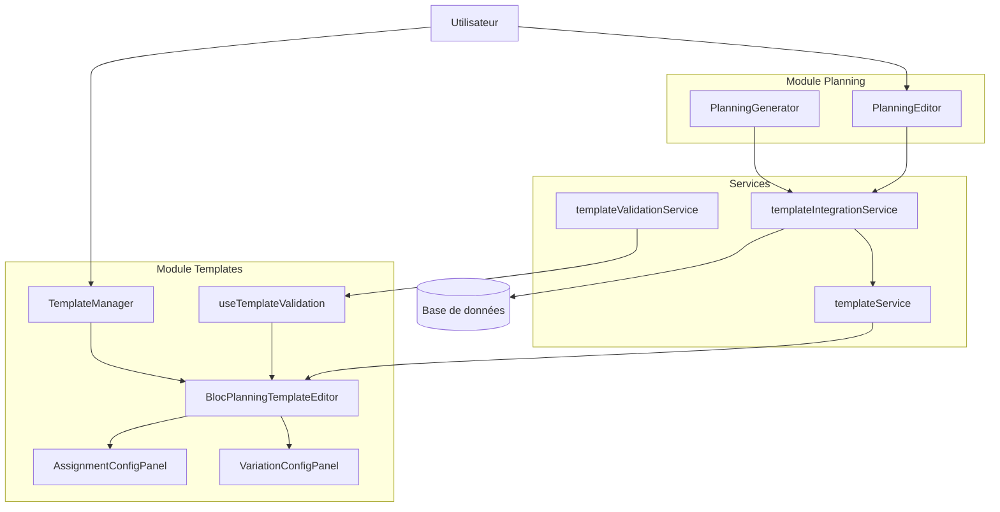
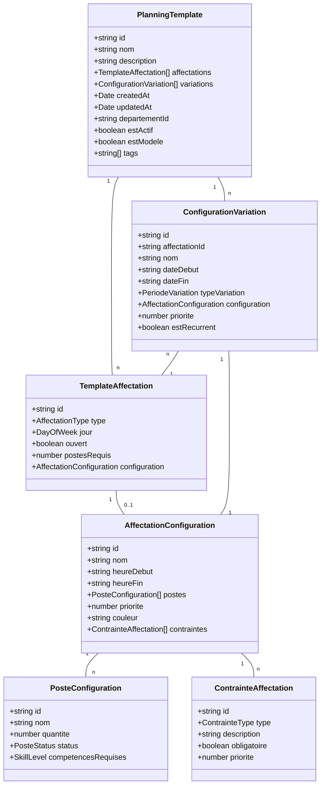

# Système de Trames de Planning avec Affectations Configurables

## Vue d'ensemble

Le système de trames de planning avec affectations configurables permet de définir des modèles standardisés de planification avec des configurations détaillées pour chaque affectation (consultations, blocs opératoires, gardes). Ces trames servent de base à la génération de plannings, en respectant les contraintes métier et en permettant des variations selon les périodes.

## Architecture du système



## Composants principaux

### Services

#### templateService

Service principal pour les opérations CRUD sur les trames de planning.

**Fonctionnalités clés :**
- Création, lecture, mise à jour et suppression de trames
- Recherche de trames avec filtrage et pagination
- Duplication de trames existantes
- Exportation et importation de trames au format JSON

#### templateValidationService

Service de validation qui vérifie les contraintes métier sur les trames.

**Fonctionnalités clés :**
- Validation des métadonnées de base (nom, département)
- Validation des affectations (unicité, cohérence des postes requis)
- Validation des configurations (format des heures, cohérence des postes)
- Validation des variations (références, chevauchements)
- Vérification des règles métier globales

#### templateIntegrationService

Service d'intégration pour connecter les trames avec d'autres modules.

**Fonctionnalités clés :**
- Export/import de trames
- Application de trames à des plannings
- Vérification de compatibilité avec des plannings existants
- Comparaison de configurations

### Hooks

#### useTemplateValidation

Hook React pour intégrer la validation des trames dans les composants.

**Fonctionnalités clés :**
- Validation à la demande ou automatique
- Filtrage des erreurs par champ
- Résumé des erreurs et avertissements

### Composants UI

#### TemplateManager

Composant de gestion qui affiche la liste des trames et permet les opérations de base.

#### BlocPlanningTemplateEditor

Éditeur principal de trames organisé par jours de la semaine.

#### AssignmentConfigPanel

Panneau de configuration d'une affectation spécifique avec définition des postes.

#### VariationConfigPanel

Panneau de configuration des variations d'affectations selon les périodes.

## Modèle de données



## Types d'énumération

```typescript
type AffectationType = 'CONSULTATION' | 'BLOC_OPERATOIRE' | 'GARDE_JOUR' | 'GARDE_NUIT' | 'ASTREINTE';
type DayOfWeek = 'LUNDI' | 'MARDI' | 'MERCREDI' | 'JEUDI' | 'VENDREDI' | 'SAMEDI' | 'DIMANCHE';
type SkillLevel = 'JUNIOR' | 'INTERMEDIAIRE' | 'SENIOR' | 'EXPERT';
type PosteStatus = 'REQUIS' | 'OPTIONNEL' | 'INDISPONIBLE';
type PeriodeVariation = 'STANDARD' | 'VACANCES' | 'HIVER' | 'ETE' | 'JOURS_FERIES' | 'PERSONNALISEE';
type ContrainteType = 'HORAIRE' | 'PERSONNEL' | 'COMPETENCE' | 'EQUIPEMENT' | 'PRIORITE';
```

## Système de validation

Le système de validation utilise des types dédiés pour représenter les erreurs et les résultats de validation :

```typescript
type ValidationSeverity = 'ERROR' | 'WARNING' | 'INFO';
type ValidationErrorType = 'MISSING_REQUIRED_FIELD' | 'VALIDATION_ERROR' | 'INVALID_FORMAT' | /* ... */;

interface ValidationError {
    type: ValidationErrorType;
    field: string;
    message: string;
    severity: ValidationSeverity;
    metadata?: Record<string, any>;
}

interface ValidationResult {
    isValid: boolean;
    errors: ValidationError[];
    warnings: ValidationError[];
}
```

La validation est effectuée à plusieurs niveaux :
1. Validation des métadonnées de base (nom, département)
2. Validation des affectations (unicité, ouverture)
3. Validation des configurations (heures, postes)
4. Validation des variations (dates, chevauchements)
5. Règles métier globales (cohérence des postes requis)

## Intégration avec le module de Planning

Le module de trames s'intègre avec le module de planning via le service d'intégration :

1. **Application d'une trame à un planning** : Une trame peut être appliquée à une période spécifique pour générer automatiquement des affectations dans le planning.

```typescript
// Exemple d'application d'une trame à un planning
const planningId = await templateIntegrationService.applyTemplateToPlanning(
    'tmpl_1',
    new Date(2025, 0, 1),  // 1er janvier 2025
    new Date(2025, 0, 31)  // 31 janvier 2025
);
```

2. **Vérification de compatibilité** : Avant d'appliquer une trame, sa compatibilité avec un planning existant peut être vérifiée.

```typescript
// Exemple de vérification de compatibilité
const compatibility = await templateIntegrationService.checkTemplateCompatibility(
    'tmpl_1',
    'planning_existant'
);

if (compatibility.isCompatible) {
    console.log('La trame est compatible avec le planning existant');
} else {
    console.log('Conflits détectés :', compatibility.conflicts);
}
```

## Export/Import et duplication

Le système permet l'exportation, l'importation et la duplication de trames :

1. **Exportation** : Les trames peuvent être exportées au format JSON pour partage ou sauvegarde.

```typescript
// Exemple d'exportation et téléchargement d'une trame
await templateIntegrationService.downloadTemplateAsJSON('tmpl_1', 'trame_hebdomadaire.json');
```

2. **Importation** : Les trames exportées peuvent être importées, avec attribution de nouveaux IDs pour éviter les conflits.

```typescript
// Exemple d'importation d'une trame
const fileInput = document.getElementById('fileInput') as HTMLInputElement;
const file = fileInput.files[0];
const importedTemplate = await templateIntegrationService.importTemplateFromJSON(file);
```

3. **Duplication** : Les trames existantes peuvent être dupliquées pour créer rapidement des variantes.

```typescript
// Exemple de duplication d'une trame
const newTemplate = await templateIntegrationService.duplicateTemplate(
    'tmpl_1',
    'Trame d\'été 2025'
);
```

## Cas d'utilisation typiques

### 1. Création d'une trame hebdomadaire standard

```typescript
// Exemple de création d'une trame hebdomadaire standard
const newTemplate = {
    id: 'temp_new',
    nom: 'Trame Hebdomadaire Standard',
    description: 'Trame standard pour semaine normale',
    departementId: 'dept_1',
    affectations: [
        {
            id: 'temp_aff_1',
            jour: 'LUNDI',
            type: 'CONSULTATION',
            ouvert: true,
            postesRequis: 2
        },
        {
            id: 'temp_aff_2',
            jour: 'MARDI',
            type: 'BLOC_OPERATOIRE',
            ouvert: true,
            postesRequis: 3
        }
        // ... autres affectations
    ]
};

const savedTemplate = await templateService.saveTemplate(newTemplate);
```

### 2. Configuration détaillée d'une affectation

```typescript
// Exemple de configuration d'une affectation
const configuration = {
    id: 'conf_new',
    nom: 'Bloc Opératoire Mardi Matin',
    heureDebut: '08:00',
    heureFin: '12:30',
    postes: [
        {
            id: 'poste_1',
            nom: 'Chirurgien',
            quantite: 1,
            status: 'REQUIS',
            competencesRequises: 'SENIOR'
        },
        {
            id: 'poste_2',
            nom: 'Anesthésiste',
            quantite: 1,
            status: 'REQUIS',
            competencesRequises: 'SENIOR'
        },
        {
            id: 'poste_3',
            nom: 'IADE',
            quantite: 1,
            status: 'REQUIS',
            competencesRequises: 'INTERMEDIAIRE'
        }
    ],
    priorite: 2,
    couleur: '#4CAF50'
};

await templateService.saveAffectationConfiguration(
    'tmpl_1',
    'aff_2',
    configuration
);
```

### 3. Ajout d'une variation saisonnière

```typescript
// Exemple d'ajout d'une variation pour l'été
const variation = {
    id: 'var_new',
    affectationId: 'aff_2',
    nom: 'Configuration été - Bloc Opératoire',
    typeVariation: 'ETE',
    dateDebut: '2025-06-01',
    dateFin: '2025-09-30',
    configuration: {
        id: 'conf_var_new',
        nom: 'Bloc Opératoire Mardi Matin (Été)',
        heureDebut: '07:30',
        heureFin: '13:00',
        postes: [
            {
                id: 'poste_var_1',
                nom: 'Chirurgien',
                quantite: 2,  // Augmenté pour l'été
                status: 'REQUIS',
                competencesRequises: 'SENIOR'
            },
            // ... autres postes
        ],
        priorite: 2,
        couleur: '#FF9800'
    },
    priorite: 10,
    estRecurrent: true
};

await templateService.saveConfigurationVariation('tmpl_1', variation);
```

### 4. Validation d'une trame avant sauvegarde

```typescript
// Exemple de validation d'une trame avant sauvegarde
const template = await templateService.getTemplateById('tmpl_1');
const validationResult = templateValidationService.validateTemplate(template);

if (validationResult.isValid) {
    console.log('La trame est valide et prête à être enregistrée');
    await templateService.saveTemplate(template);
} else {
    console.error('La trame contient des erreurs :', validationResult.errors);
    // Afficher les erreurs à l'utilisateur
}
```

## Utilisation dans les composants React

Le hook `useTemplateValidation` facilite l'intégration de la validation dans les composants React :

```tsx
function TemplateForm({ templateId }) {
    const [template, setTemplate] = useState<PlanningTemplate | null>(null);
    const { validateTemplate, getFieldErrors, isValid } = useTemplateValidation();
    
    useEffect(() => {
        // Charger la trame
        templateService.getTemplateById(templateId).then(setTemplate);
    }, [templateId]);
    
    const handleSave = async () => {
        if (template) {
            const result = validateTemplate(template);
            if (result.isValid) {
                await templateService.saveTemplate(template);
                showNotification('Trame enregistrée avec succès');
            } else {
                showErrors(result.errors);
            }
        }
    };
    
    if (!template) return <Loading />;
    
    return (
        <form>
            <div>
                <label>Nom</label>
                <input
                    value={template.nom}
                    onChange={(e) => setTemplate({...template, nom: e.target.value})}
                />
                {getFieldErrors('nom').map(error => (
                    <div className="error">{error.message}</div>
                ))}
            </div>
            
            {/* Autres champs... */}
            
            <button onClick={handleSave} disabled={!isValid()}>
                Enregistrer
            </button>
        </form>
    );
}
```

## Bonnes pratiques et recommandations

1. **Validation précoce** : Utiliser `templateValidationService` dès que possible pour détecter les problèmes tôt
2. **Gestion des variations** : Privilégier les variations typées ('ETE', 'HIVER') plutôt que personnalisées sauf nécessité
3. **Configurations cohérentes** : S'assurer que la somme des postes requis dans la configuration correspond à `postesRequis`
4. **Nommage explicite** : Utiliser des noms clairs pour les trames et les configurations
5. **Exportation régulière** : Exporter régulièrement les trames importantes pour sauvegarde
6. **Tests avant application** : Vérifier la compatibilité avant d'appliquer une trame à un planning existant

## Tests

Le système de trames est couvert par des tests unitaires et d'intégration :

- Tests unitaires pour les services `templateValidationService` et `templateIntegrationService`
- Tests d'intégration pour l'application des trames aux plannings
- Tests des composants UI avec React Testing Library

## Extensions futures

1. **Règles avancées** : Ajout de règles plus complexes pour la validation des trames
2. **Historique de versions** : Suivi des modifications des trames avec possibilité de revenir à des versions antérieures
3. **Suggestions automatiques** : Système de recommandation de configurations basé sur les données historiques
4. **Preview visuelle** : Visualisation des affectations et variations dans un calendrier avant application
5. **Templates partagés** : Bibliothèque de templates prédéfinis pour différents services 